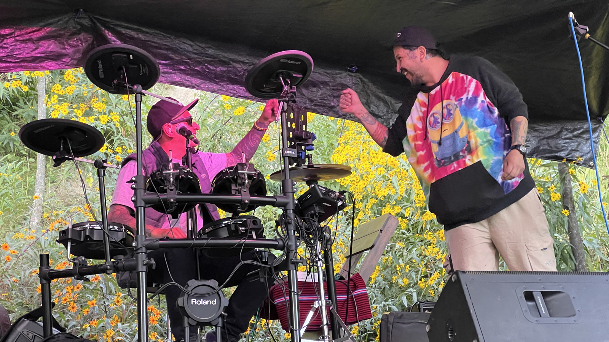

[4/20²⁶ 🌿](./README.md) > Artistas y Música

# Artistas y Música

**Encuentro Nacional 4/20²⁶ Pro-Legalización 🌿**  
*Celebración cultural replicable de ingreso y participación libre*

> 🌿 La música es una de las formas en que el encuentro puede brotar. No la única. Pero sí una de las más naturales para abrir espacio, comunidad y celebración.

> 🌿 Este documento está pensado primero para artistas, DJs, bandas, solistas y otras propuestas musicales que estén considerando sumarse al encuentro.
>
> ℹ️ La convocatoria específica para [artistas y música](https://forms.gle/jfiZqSWUhqTDG45C8) ya está abierta. Este archivo deja claro el espíritu general, para que artistas y espacios puedan imaginar mejor las colaboraciones posibles.

## Qué lugar tienen artistas y música en el encuentro

La música puede ser una de las puertas más naturales para que el encuentro cobre vida.

No se piensa solo como entretenimiento. También puede ayudar a:

- Abrir el encuentro a una comunidad nueva.
- Crear una atmósfera hospitalaria y culturalmente defendible.
- Acompañar feria, conversación, expo o encuentro comunitario.
- Hacer visible el 4/20 de una manera más madura, libre y responsable.
- Volver la experiencia memorable, amable y viva.

No todos los [espacios anfitriones](./SPACES.md) tienen que tener música. Pero cuando sí la tienen, puede ser una de las formas más naturales de reunir comunidad, abrir conversación y dar identidad a una sede.

## Cómo se entiende la participación artística

La participación artística, como la del público y la del propio espacio anfitrión, se piensa en principio como **voluntaria**.

Eso ayuda a mantener el espíritu del encuentro, minimiza riesgos innecesarios y refuerza una lógica en la que cada quien se suma por voluntad propia, no solo por transacción entre partes.

Al mismo tiempo, eso no significa que un artista tenga que salir perdiendo por participar.

Si una propuesta viene de lejos, necesita cubrir transporte, mover equipos grandes, resolver alojamiento o asumir una logística que excede lo razonable, la idea es que eso pueda hablarse con claridad. Cuando haga sentido, se buscará junto a la [comunidad](https://chat.whatsapp.com/KvN6wsDnoLR1ytdLJI3m00) y al [espacio anfitrión](./SPACES.md) la mejor forma de cubrir o aliviar esos costos.

## Qué tipo de propuestas musicales podrían sumarse

La invitación está abierta, por ejemplo, a:

- DJs
- Sets en vivo
- Bandas
- Solistas
- Dúos o formatos acústicos
- Propuestas sonoras híbridas
- Colaboraciones entre artistas y espacios
- Otras formas musicales que hagan sentido con el espíritu del [encuentro](./README.md)

Lo importante no es encajar en una etiqueta perfecta, sino aportar a una celebración cuidada, hospitalaria y con identidad propia.

## Qué se valora en una propuesta artística

Más allá del estilo, se valora especialmente:

- Cuidado del espacio.
- Buena disposición para coordinar.
- Apertura a formatos proporcionales al lugar.
- Comprensión del contexto legal y cultural.
- Voluntad de aportar a una experiencia hospitalaria, no solo a una presentación aislada.

## Qué puede hacer posible un espacio que se suma

Una sede que se abre al encuentro no necesariamente tiene que producir todo por su cuenta.

Dependiendo de la ciudad, del momento y de la red que se active, un espacio anfitrión podría encontrarse con:

- Artistas o DJs que quieran sumarse voluntariamente.
- Propuestas acústicas o de formato pequeño que requieran poca infraestructura.
- Una comunidad ya atenta a nuevos espacios donde el encuentro pueda brotar.
- La posibilidad de abrirse a un público nuevo, con más cuidado y previsión que improvisación.
- Una experiencia que, bien llevada, se parezca a ser [voluntariado por un día](https://voluntariado.barranco.life/Actividades/A%C3%B1o_Nuevo.html): una pequeña prueba de lo que puede hacer posible una comunidad cuando se organiza con claridad, hospitalidad y propósito compartido.

Eso no significa prometer resultados automáticos. Significa dejar abierta una posibilidad real.

## Lo general y lo particular de cada sede

No todos los espacios tienen que organizar la música del mismo modo.

Hay decisiones que pueden variar según cada sede, por ejemplo:

- Mantener toda la participación como voluntaria.
- Cubrir algunos costos logísticos concretos.
- Decidir si habrá o no una barra o alguna otra fuente de ingresos.
- Tener o no fee para artistas.
- Hacer algo totalmente abierto o algo más pequeño y prudente.

La idea no es volver excluyente el encuentro por fijar un solo modelo, sino sumar posibilidades. Cada espacio puede adaptar estos lineamientos según su realidad, sabiendo que mientras más se aparte del espíritu general, más entra en decisiones propias y menos en una lógica ya probada por la experiencia compartida del [encuentro](./README.md).

## Caso particular: Proyecto Cultural Barranco

En [Proyecto Cultural Barranco](https://barranco.life), la referencia actual para este año es abrir nuevamente **tres escenarios simultáneos**:

- **Barranco (abajo):** escenario para música en vivo, con sonidista, amplificación y equipos necesarios propios del espacio.
- **El Parrillero:** espacio para DJs, con una tabla Pioneer DDJ SX2 y una computadora con Serato.
- **La galería:** nuevamente pensada como *open deck*, con amplificación disponible, pero dependiente de que la propia comunidad y los voluntarios ayuden a organizar o facilitar una tabla de DJ u otros equipos mínimos a través del [chat de la comunidad](https://chat.whatsapp.com/KvN6wsDnoLR1ytdLJI3m00).

Esto se menciona aquí por dos razones:

- Para que artistas y músicos sepan qué cosas ya existen y qué cosas se podrían hacer realidad.
- Para que otros espacios tengan una idea más concreta de cómo una sede puede armar una celebración real combinando lo propio del lugar con lo que la comunidad ayuda a activar.

No se presenta como modelo obligatorio. Se presenta como un caso vivo de referencia.

## Qué puede aportar el encuentro a artistas y músicos

Así como un [espacio](./SPACES.md) puede abrirse a una nueva comunidad, también una propuesta musical puede encontrar aquí:

- Un contexto cultural distinto al circuito habitual.
- Un público nuevo.
- Una experiencia más horizontal y comunitaria.
- La posibilidad de tocar en diálogo con feria, conversación, expo o naturaleza.
- Un primer puente con espacios que quizá luego quieran seguir programando otras cosas.

## Relación con otros documentos

Este archivo dialoga especialmente con:

- [Espacios Anfitriones](./SPACES.md)
- [Participar](./PARTICIPATE.md)
- [Página principal del encuentro](./README.md)
- [Manual 4/20 🌿](https://manual420.barranco.life)
- [4/20²⁶ 🪴](https://chat.whatsapp.com/KvN6wsDnoLR1ytdLJI3m00)
- [Proyecto Cultural Barranco (Maps)](https://goo.gl/maps/iWB6R5HZnREL7ALKA)
- [Voluntariado Barranco](https://voluntariado.barranco.life/)
