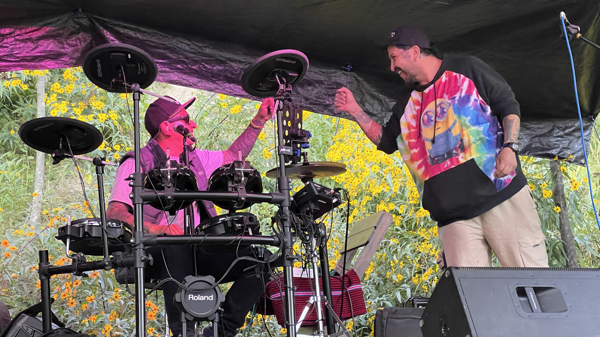

[4/20²⁶ 🌿](./README.md) > Artistas y Música

# Artistas y Música

**Encuentro Nacional 4/20²⁶ Pro-Legalización 🌿**  
*Celebración cultural replicable de ingreso y participación libre*

> 🌿 La música es una de las formas en que el encuentro puede brotar. No la única. Pero sí una de las más naturales para abrir espacio, comunidad y celebración.

>
> ℹ️ Este archivo preserva el espíritu de la capa artística y sirve como playbook para futuras ediciones. El formulario 2026 como referencia: [Artistas y Música](https://forms.gle/jfiZqSWUhqTDG45C8).

## Qué lugar tienen artistas y música en el encuentro

La música puede ser una de las puertas más naturales para que el encuentro cobre vida.

Replicar eventos 4/20 en distintas ciudades no es un detalle logístico: es parte de la estrategia del movimiento. Y la música suele ser una de las formas más naturales en que esa estrategia empieza a volverse visible, hospitalaria y memorable.

No se piensa solo como entretenimiento. También puede ayudar a:

- Abrir el encuentro a una comunidad nueva.
- Crear una atmósfera hospitalaria y culturalmente defendible.
- Acompañar feria, conversación, expo o encuentro comunitario.
- Hacer visible el 4/20 de una manera más madura, libre y responsable.
- Volver la experiencia memorable, amable y viva.

No todos los [espacios anfitriones](./SPACES.md) tienen que tener música. Pero cuando sí la tienen, puede ser una de las formas más naturales de reunir comunidad, abrir conversación y dar identidad a una sede.

## Cómo se entiende la participación artística

La participación artística, como la del público y la del propio espacio anfitrión, se piensa en principio como **voluntaria**.

Eso ayuda a mantener el espíritu del encuentro, minimiza riesgos innecesarios y refuerza una lógica en la que cada quien se suma por voluntad propia, no solo por transacción entre partes.

Al mismo tiempo, eso no significa que un artista tenga que salir perdiendo por participar.

Si una propuesta viene de lejos, necesita cubrir transporte, mover equipos grandes, resolver alojamiento o asumir una logística que excede lo razonable, la idea es que eso pueda hablarse con claridad. Cuando haga sentido, se buscará junto al [Chat 4/20²⁶ 🌿](https://chat.whatsapp.com/LGRvbEMEBZ8HruAqFBUoSE), el grupo departamental correspondiente y el [espacio anfitrión](./SPACES.md) la mejor forma de cubrir o aliviar esos costos.

## Qué tipo de propuestas musicales podrían sumarse

La invitación está abierta, por ejemplo, a:

- DJs
- Sets en vivo
- Bandas
- Solistas
- Dúos o formatos acústicos
- Propuestas sonoras híbridas
- Colaboraciones entre artistas y espacios
- Otras formas musicales que hagan sentido con el espíritu del [encuentro](./README.md)

Lo importante no es encajar en una etiqueta perfecta, sino aportar a una celebración cuidada, hospitalaria y con identidad propia.

Cuando aparece un espacio, muchas veces la comunidad empieza a articularse bastante orgánicamente: se suman artistas, emprendimientos, apoyo para armar, difusión y gente que quiere aportar de una u otra manera.

## Qué se valora en una propuesta artística

Más allá del estilo, se valora especialmente:

- Cuidado del espacio.
- Buena disposición para coordinar.
- Apertura a formatos proporcionales al lugar.
- Comprensión del contexto legal y cultural.
- Comprensión del contexto territorial y electoral cuando corresponda.
- Voluntad de aportar a una experiencia hospitalaria, no solo a una presentación aislada.

## Qué puede hacer posible un espacio que se suma

Una sede que se abre al encuentro no necesariamente tiene que producir todo por su cuenta.

Dependiendo de la ciudad, del momento y de la red que se active, un espacio anfitrión podría encontrarse con:

- Artistas o DJs que quieran sumarse voluntariamente.
- Propuestas acústicas o de formato pequeño que requieran poca infraestructura.
- Una comunidad ya atenta a nuevos espacios donde el encuentro pueda brotar.
- La posibilidad de abrirse a un público nuevo, con más cuidado y previsión que improvisación.
- Una experiencia que, bien llevada, se parezca a ser [voluntariado por un día](https://voluntariado.barranco.life/Actividades/A%C3%B1o_Nuevo.html): una pequeña prueba de lo que puede hacer posible una comunidad cuando se organiza con claridad, hospitalidad y propósito compartido.

Eso no significa prometer resultados automáticos. Significa dejar abierta una posibilidad real.

## Lo general y lo particular de cada sede

No todos los espacios tienen que organizar la música del mismo modo.

Hay decisiones que pueden variar según cada sede, por ejemplo:

- Mantener toda la participación como voluntaria.
- Cubrir algunos costos logísticos concretos.
- Decidir si habrá o no una barra o alguna otra fuente de ingresos.
- Tener o no fee para artistas.
- Hacer algo totalmente abierto o algo más pequeño y prudente.

La idea no es volver excluyente el encuentro por fijar un solo modelo, sino sumar posibilidades. Cada espacio puede adaptar estos lineamientos según su realidad, sabiendo que mientras más se aparte del espíritu general, más entra en decisiones propias y menos en una lógica ya probada por la experiencia compartida del [encuentro](./README.md).

En departamentos donde exista segunda vuelta el domingo 19, una capa musical puede seguir siendo valiosa, pero conviene pensar con especial cuidado cualquier actividad del fin de semana previo y, por prudencia, poner el foco especialmente en el lunes 20 o en formatos muy cuidados.

## Caso particular: Proyecto Cultural Barranco

En [Proyecto Cultural Barranco](https://barranco.life), el 4/20²⁶ funcionó con **tres escenarios simultáneos**: escenario de música en vivo (Barranco abajo), espacio de DJs (El Parrillero) y galería como *open deck*. Katarsis mezcló más de cuatro horas con el espíritu correcto.

Aprendizaje importante de la experiencia 2026: la flexibilidad horaria importa. Un evento estilo Voluntariado Barranco no es una grilla rígida — es una experiencia co-creada. Los artistas que llegaron con esa comprensión encontraron el espacio más vivo. Futuros reencuentros DJ y conciertos en Barranco son posibles como espacio alternativo.

Esto se menciona para que otros espacios tengan una idea más concreta de cómo una sede puede armar una celebración real combinando lo propio del lugar con lo que la comunidad ayuda a activar.

No se presenta como modelo obligatorio. Se presenta como un caso vivo de referencia.

## Qué puede aportar el encuentro a artistas y músicos

Así como un [espacio](./SPACES.md) puede abrirse a una nueva comunidad, también una propuesta musical puede encontrar aquí:

- Un contexto cultural distinto al circuito habitual.
- Un público nuevo.
- Una experiencia más horizontal y comunitaria.
- La posibilidad de tocar en diálogo con feria, conversación, expo o naturaleza.
- Un primer puente con espacios que quizá luego quieran seguir programando otras cosas.
- Una forma de estar presentes en ciudades donde la red 4/20 todavía está brotando.

## Relación con otros documentos

- [Espacios Anfitriones](./SPACES.md)
- [Participar](./PARTICIPATE.md)
- [Cómo contribuir](./CONTRIBUTE.md)
- [Artistas Visuales / Expo](./EXHIBITION.md)
- [Página principal del encuentro](./README.md)
- [Manual 4/20 🌿](https://manual420.barranco.life)
- [Chat 4/20²⁶ 🌿](https://chat.whatsapp.com/LGRvbEMEBZ8HruAqFBUoSE)
- [La Paz 4/20²⁶ 🟢](https://chat.whatsapp.com/JCVnlJgnL78G7S3ejXSL52)
- [Cochabamba 4/20²⁶ 🟢](https://chat.whatsapp.com/Be6udeZmtBV6lGgMSsXAWz)
- [Potosí 4/20²⁶ 🟡](https://chat.whatsapp.com/HMNS1eCZ9bY36FcpFbT5Kp)
- [Santa Cruz 4/20²⁶ ⚪️](https://chat.whatsapp.com/I9z6mOAEsfJ5wFHwNvvEer)
- [Tarija 4/20²⁶ ⚪️](https://chat.whatsapp.com/DOEQk4gdyr10MIAmKNyQxa)
- [Chuquisaca 4/20²⁶ ⚪️](https://chat.whatsapp.com/Jjkf5BeKZ99C482SEh6Gaj)
- [Oruro 4/20²⁶ ⚪️](https://chat.whatsapp.com/L96GjiiFHhiL8TT36wcG5b)
- [Proyecto Cultural Barranco](https://barranco.life)
- [Voluntariado Barranco](https://voluntariado.barranco.life/)

La música no reemplaza el corazón cultural del encuentro. Pero sí puede ser una de las formas más naturales de abrir espacio, comunidad y celebración, especialmente cuando una ciudad o una sede recién están empezando a brotar.
