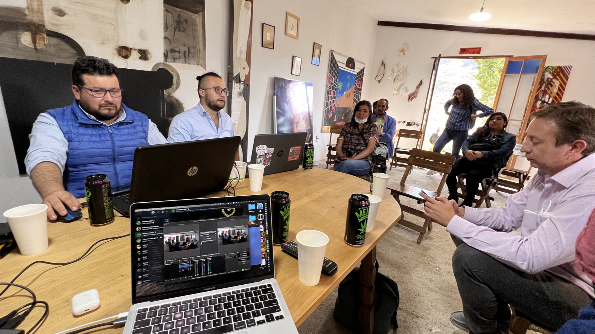

[4/20²⁶ 🌿](./README.md) > Coloquio

# Coloquio

**Encuentro Nacional 4/20²⁶ Pro-Legalización 🌿**  
*Celebración cultural replicable de ingreso y participación libre*

> 🌿 El coloquio es una de las formas más claras de abrir conversación dentro del encuentro. No la única. Pero sí una de las más valiosas para volver el tema más legible, más humano y menos rígido.
>
> 🌿 También puede ser una de las puertas más claras para matizar prejuicios y abrir el tema a personas que no llegarían primero por otras capas del encuentro.

> ℹ️ La convocatoria específica para [panelistas y conversación pública](https://forms.gle/Ufv8JDgU3FvjaAru9) ya está abierta. Este documento deja claro el espíritu general, para que panelistas, participantes remotos y espacios puedan imaginar mejor las posibilidades de esta capa del encuentro.

> *Día central 2026:* *lunes 20 de abril de 2026*.
>
> *Actividades opcionales:* viernes 17 al domingo 19, según cada espacio.
>
> *Nota electoral:* en [Oruro](https://chat.whatsapp.com/L96GjiiFHhiL8TT36wcG5b), Beni, [Chuquisaca](https://chat.whatsapp.com/Jjkf5BeKZ99C482SEh6Gaj), [Tarija](https://chat.whatsapp.com/DOEQk4gdyr10MIAmKNyQxa) y [Santa Cruz](https://chat.whatsapp.com/I9z6mOAEsfJ5wFHwNvvEer), la segunda vuelta del domingo 19 de abril condiciona fuertemente cualquier actividad pública ese fin de semana. El día de la votación no debe contarse como fecha útil para actividad pública, y por prudencia el foco allí debería ponerse especialmente en el lunes 20 o en formatos muy cuidados.

## Qué lugar tiene el coloquio en el encuentro

El coloquio no se piensa como un adorno intelectual ni como una formalidad para “justificar” la celebración.

Se piensa como una de las formas más útiles de abrir una conversación más madura sobre cultura 4/20, legalidad, convivencia, salud, límites, organización y desestigmatización.

Replicar eventos 4/20 en distintas ciudades no es un detalle logístico: es parte de la estrategia del movimiento. Y una capa de conversación pública puede ayudar mucho a eso, porque vuelve el tema más legible, más humano y más compartible incluso para personas que no entrarían primero por otras capas del encuentro.

También puede ayudar a:

- Abrir el encuentro a personas escépticas o no consumidoras.
- Volver el tema más legible para público general.
- Reunir perspectivas que no suelen escucharse en el mismo espacio.
- Darle densidad cultural y humana al encuentro.
- Dejar aprendizajes que luego puedan alimentar el [Manual 4/20 🌿](https://manual420.barranco.life).

## Qué tipo de participación puede hacer sentido

La convocatoria está abierta, por ejemplo, a:

- Panelistas
- Participantes en conversación pública
- Personas con experiencia cultural o comunitaria
- Abogados o personas vinculadas a reflexión legal
- Profesionales o estudiantes del campo de la salud
- Activistas o personas con experiencia organizativa
- Voces internacionales o remotas
- Otras perspectivas que puedan enriquecer el [encuentro](./README.md)

Lo importante no es defender una sola postura con rigidez, sino ayudar a que la conversación gane contexto, humanidad y matices.

## Cómo se entiende esta conversación

No se busca repetir una discusión cerrada entre personas ya convencidas.

Tampoco se trata de armar una mesa puramente ideológica donde todo gire alrededor de una sola pregunta abstracta. La experiencia de años anteriores mostró que, cuando el coloquio se queda demasiado en la justificación entre convencidos, pierde parte de su potencia real.

Interesa más abrir conversación sobre:

- Desestigmatización
- Libertad con límites
- Hospitalidad cultural
- Organización prudente
- Salud y reducción de riesgos
- Experiencias de comunidad
- Formas no confrontacionales de visibilización
- Aprendizajes que puedan alimentar el [Manual 4/20 🌿](https://manual420.barranco.life)

## Qué puede resultar para un espacio que se suma

Una sede que abre una conversación pública no necesariamente tiene que convertirse en auditorio formal.

Dependiendo del lugar, del momento y de la red que se active, un espacio anfitrión podría encontrarse con:

- Personas dispuestas a participar de forma voluntaria.
- Conversaciones presenciales, remotas o híbridas.
- Un formato de menor costo y menor presión que otras capas del encuentro.
- Una forma muy clara de abrir el espacio a público general.
- Una experiencia que, bien llevada, se parezca a ser [voluntariado por un día](https://voluntariado.barranco.life/Actividades/A%C3%B1o_Nuevo.html): una pequeña prueba de lo que puede hacer posible una comunidad cuando se organiza con cuidado, escucha y propósito compartido.

Eso no significa prometer resultados automáticos. Significa dejar abierta una posibilidad real y valiosa.

## Participación voluntaria y costos

La participación en el coloquio, como la del público, la del espacio anfitrión y la de otras propuestas del encuentro, se piensa en principio como **voluntaria**.

Eso ayuda a mantener el espíritu general del proyecto y reduce fricciones innecesarias.

Al mismo tiempo, eso no significa que una persona deba asumir por su cuenta costos desproporcionados por participar.

Si alguien viene de lejos, requiere conexión especial, necesita traslado, alojamiento o alguna otra logística que excede lo razonable, la idea es que eso pueda hablarse con claridad. Cuando haga sentido, se buscará junto al [Chat 4/20²⁶ 🌿](https://chat.whatsapp.com/LGRvbEMEBZ8HruAqFBUoSE), el grupo departamental correspondiente y el [espacio anfitrión](./SPACES.md) la mejor forma de cubrir o aliviar esos costos.

## Lo general y lo particular de cada sede

No todos los espacios tienen que alojar un coloquio del mismo modo.

Hay decisiones que pueden variar según cada sede, por ejemplo:

- Hacer una conversación breve o una mesa más larga.
- Incluir o no participación remota.
- Tener una conversación muy íntima o algo más abierto.
- Enfocar el coloquio en salud, organización, cultura, legalidad o experiencias comunitarias.
- Integrarlo con música, expo, feria o transmisión.

La idea no es fijar un solo modelo, sino sumar posibilidades. Cada espacio puede adaptar estos lineamientos según su realidad, sabiendo que mientras más se aparte del espíritu general, más entra en decisiones propias y menos en una lógica ya probada por la experiencia compartida del [encuentro](./README.md).

En departamentos donde exista segunda vuelta el domingo 19, una capa de conversación pública puede seguir siendo valiosa, pero conviene pensar con especial cuidado cualquier actividad del fin de semana previo y, por prudencia, poner el foco especialmente en el lunes 20 o en formatos muy cuidados.

## Caso particular: Proyecto Cultural Barranco

En [Proyecto Cultural Barranco](https://barranco.life), la referencia viva para el coloquio viene sobre todo de la experiencia de [4/20²²](./HISTORY.md#2022).

Esa experiencia dejó claro algo importante: el coloquio pierde fuerza cuando se queda demasiado en justificar la legalización ante personas que ya están convencidas. En cambio, gana mucho más valor cuando ayuda a pensar cómo volver el encuentro más hospitalario, más prudente, más legible y más útil para abrir conversación con otras personas.

Por eso, una línea valiosa para este año es pensar el coloquio no solo como mesa de argumentos, sino también como espacio para compartir aprendizajes reales sobre organización, cuidado, comunidad y estrategias no confrontacionales de visibilización.

En el caso del Barranco, si hay participantes suficientes, la idea es que el coloquio se realice de **2 a 4pm**.

También está pensado para abrirse a participación remota. La plataforma y el link se develarán en el [Chat 4/20²⁶ 🌿](https://chat.whatsapp.com/LGRvbEMEBZ8HruAqFBUoSE) y, cuando haga falta, por grupos más específicos según territorio o modalidad.

Además, si existen otros espacios y coloquios en paralelo, una posibilidad muy valiosa es que se realicen en el mismo rango horario y que el tema principal no sea solo argumentar a favor de la legalización, sino escuchar qué experiencias están teniendo con la organización y qué aprendizajes podrían enriquecer luego la documentación del encuentro y el [Manual 4/20 🌿](https://manual420.barranco.life).

No se presenta como modelo obligatorio. Se presenta como un caso vivo de referencia.

## Qué puede aportar el encuentro a panelistas y participantes

Así como un [espacio](./SPACES.md) puede abrirse a una nueva comunidad, también una persona invitada a conversar puede encontrar aquí:

- Un contexto distinto al formato habitual de panel.
- Una conversación más horizontal y viva.
- Un público nuevo.
- La posibilidad de dialogar con arte, música, comunidad y experiencia territorial.
- Un primer puente con otros espacios, personas y proyectos.
- Una forma de estar presentes en ciudades donde la red 4/20 todavía está brotando.

## Qué se valora en una participación de coloquio

Más allá de la postura o del perfil, se valora especialmente:

- Claridad para conversar sin rigidez.
- Buena disposición para escuchar y dialogar.
- Comprensión del contexto cultural y legal.
- Comprensión del contexto territorial y electoral cuando corresponda.
- Capacidad de aportar matices y no solo consignas.
- Voluntad de abrir conversación, no de imponerla ni cerrarla.

## Relación con otros documentos

- [Espacios Anfitriones](./SPACES.md)
- [Participar](./PARTICIPATE.md)
- [Cómo contribuir](./CONTRIBUTE.md)
- [Página principal del encuentro](./README.md)
- [Manual 4/20 🌿](https://manual420.barranco.life)
- [Chat 4/20²⁶ 🌿](https://chat.whatsapp.com/LGRvbEMEBZ8HruAqFBUoSE)
- [La Paz 4/20²⁶ 🟢](https://chat.whatsapp.com/JCVnlJgnL78G7S3ejXSL52)
- [Cochabamba 4/20²⁶ 🟢](https://chat.whatsapp.com/Be6udeZmtBV6lGgMSsXAWz)
- [Potosí 4/20²⁶ 🟡](https://chat.whatsapp.com/HMNS1eCZ9bY36FcpFbT5Kp)
- [Santa Cruz 4/20²⁶ ⚪️](https://chat.whatsapp.com/I9z6mOAEsfJ5wFHwNvvEer)
- [Tarija 4/20²⁶ ⚪️](https://chat.whatsapp.com/DOEQk4gdyr10MIAmKNyQxa)
- [Chuquisaca 4/20²⁶ ⚪️](https://chat.whatsapp.com/Jjkf5BeKZ99C482SEh6Gaj)
- [Oruro 4/20²⁶ ⚪️](https://chat.whatsapp.com/L96GjiiFHhiL8TT36wcG5b)
- [Proyecto Cultural Barranco](https://barranco.life)
- [Voluntariado Barranco](https://voluntariado.barranco.life/)

El coloquio no reemplaza el corazón cultural del encuentro. Pero sí puede ayudar a que el 4/20 gane densidad humana, legibilidad pública y mayor capacidad de abrir conversación, especialmente cuando una ciudad o una sede recién están empezando a brotar.
