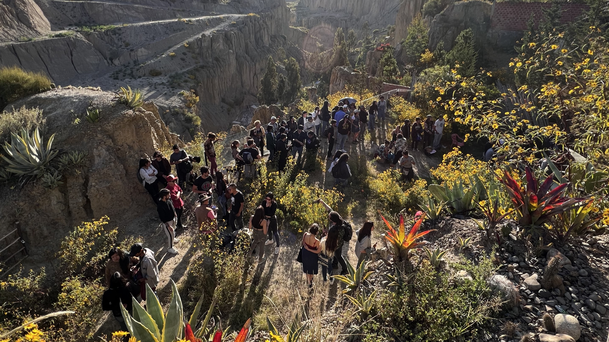

[4/20²⁶ 🌿](./README.md) > Comunidad

# Comunidad

**Encuentro Nacional 4/20²⁶ Pro-Legalización 🌿**  
*Celebración cultural replicable de ingreso y participación libre*

> 🌿 La comunidad 4/20 no empieza ni termina en este repositorio. Pero este repositorio sí puede ayudar a que esa comunidad se entienda mejor a sí misma, se articule con más claridad y se vuelva más visible sin perder su humanidad.

> 🌿 Para gran parte del público, una de las formas más útiles de ayudar en la estrategia pro-legalización es compartir todo lo referente al encuentro: links, posts, transmisiones, convocatorias y otras señales de que la conversación ya está viva.

> 🌿 No se trata de capturar la comunidad. Se trata de acompañarla mejor.

## Qué entiende este proyecto por comunidad

Cuando aquí hablamos de **comunidad**, no nos referimos solo a un grupo de WhatsApp ni solo a personas que consumen cannabis.

Nos referimos a una red mucho más amplia y viva: personas que celebran el 4/20, que tienen curiosidad, que organizan, que difunden, que dudan, que observan, que hacen arte, que abren espacios, que transmiten en vivo, que firman el [pliego petitorio](./PETITION.md), que ayudan a sostener el encuentro o que simplemente reconocen que este tema ya forma parte de la vida cultural y social del país.

La comunidad 4/20 es más grande que cualquier evento, más grande que cualquier sede y más grande que esta propuesta específica.

## Dónde vive la comunidad real

La comunidad real vive primero en sus vínculos, en sus conversaciones y en sus formas de aparecer en el mundo. En esta etapa, su espacio más directo y activo sigue siendo [4/20²⁶ 🪴](https://chat.whatsapp.com/KvN6wsDnoLR1ytdLJI3m00).

El repositorio y el sitio existen para documentar, clarificar y fortalecer lo que la comunidad ya está haciendo, no para reemplazarla ni volverla artificialmente burocrática.

## Capas de participación

Una de las intuiciones más importantes de este proyecto es que no toda participación tiene que verse igual.

Hay, al menos, varias capas posibles:

- **Personas que asisten** y hacen presencia.
- **Personas que difunden** el 4/20 y sus eventos.
- **Espacios anfitriones** que abren sede o se suman con bajo, medio o alto nivel de exposición.
- **Artistas, panelistas y propuestas culturales** que enriquecen el encuentro.
- **Celebraciones virtuales** que amplían el alcance del día.
- **Aliados ocasionales** que no se sienten parte del núcleo organizador, pero sí del movimiento cultural más amplio.
- **Voluntarios y organizadores** que sostienen tareas concretas.

Esta estructura por capas evita un error frecuente: creer que la única manera válida de sumarse es “meterse de lleno” o exponerse demasiado. No. La comunidad también crece cuando se vuelve más porosa, más hospitalaria y más fácil de habitar desde distintos niveles.

## Eventos alineados y no alineados

No todos los eventos 4/20 tienen que estar totalmente alineados con esta propuesta para aportar a la visibilización cultural del día.

Este proyecto sí tiene una identidad propia: celebra el 4/20 desde una lógica cultural replicable, de ingreso y participación libre, con prudencia legal, hospitalidad y cuidado del espacio. Pero al mismo tiempo reconoce algo más amplio: mientras más visible se vuelve la comunidad 4/20 en la vida pública —a través de eventos, celebraciones, debates, arte, encuentros o transmisiones, estén o no alineados del todo con esta propuesta— más difícil se vuelve tratar el tema como si no existiera o no importara.

Por eso, cuando haga sentido, también puede ser valioso difundir o reconocer otras expresiones del 4/20, aunque no compartan cada detalle de este enfoque.

## Relación con Voluntariado Barranco

El encuentro 4/20 no es simplemente una “actividad más” dentro de [Voluntariado Barranco](https://voluntariado.barranco.life/), pero sí dialoga profundamente con su espíritu.

Una de las tesis centrales de este proyecto es que el 4/20 muestra que sí es posible una comunidad espontánea, diversa, colaborativa y cuidadosa del espacio. Voluntariado Barranco busca cultivar durante todo el año esa misma posibilidad: una forma más libre, responsable y humana de convivir, organizarse y crear en común.

En ese sentido, la relación no es solo operativa. También es filosófica y cultural. El 4/20 fue, en parte, uno de los experimentos que mostró que esa forma de comunidad no era una fantasía.

## Cómo sumarse sin complicarlo todo

No hace falta entrar a una estructura rígida para formar parte de esta comunidad.

Hoy, una persona, proyecto o espacio puede sumarse de muchas maneras:

- Entrando a [4/20²⁶ 🪴](https://chat.whatsapp.com/KvN6wsDnoLR1ytdLJI3m00).
- Proponiendo un [espacio anfitrión](./SPACES.md).
- Difundiendo el encuentro o el [pliego petitorio](./PETITION.md).
- Participando en una [feria o capa de emprendimientos](./VENTURES.md), [expo](./EXHIBITION.md), [colloquium](./COLLOQUIUM.md) o [transmisión virtual](./VIRTUAL.md).
- Compartiendo un evento propio del 4/20 para visibilizarlo.
- Aportando ideas o materiales que fortalezcan el [Manual 4/20 🌿](https://manual420.barranco.life).
- Ayudando a abrir conversación con personas escépticas o no consumidoras.

La idea no es sobreorganizar la comunidad, sino darle mejores puntos de apoyo, documentación y coordinación a algo que ya existe y puede crecer con más claridad.

## Cuidado del tono y la convivencia

Si la comunidad quiere crecer y volverse cada vez más visible, importa también cómo habla, cómo se presenta y cómo cuida sus espacios.

Eso implica, entre otras cosas:

- Evitar reducir el tema a consignas vacías o reacción automática.
- No asumir que todo el mundo ya está convencido.
- Abrir espacio también a curiosos, escépticos y público general.
- Cuidar el trato entre personas, tanto online como presencialmente.
- No romantizar desorden, imprudencia o negligencia como si fueran sinónimos de libertad.
- Entender que una comunidad más visible también necesita volverse más legible para la sociedad en general.

La comunidad no crece solo por cantidad. También crece cuando madura su forma de mostrarse.

## Relación con otros documentos

Este archivo dialoga especialmente con:

- [Página principal del encuentro](./README.md)
- [Espacios anfitriones](./SPACES.md)
- [Mapa de participación y convocatorias](./PARTICIPATE.md)
- [Artistas y Música](./ARTISTS.md)
- [Artistas Visuales / Expo](./EXHIBITION.md)
- [Colloquium](./COLLOQUIUM.md)
- [Emprendimientos](./VENTURES.md)
- [Participación Virtual](./VIRTUAL.md)
- [Pliego petitorio](./PETITION.md)
- [Historia y aprendizajes](./HISTORY.md)
- [Manual 4/20 🌿](https://manual420.barranco.life)
