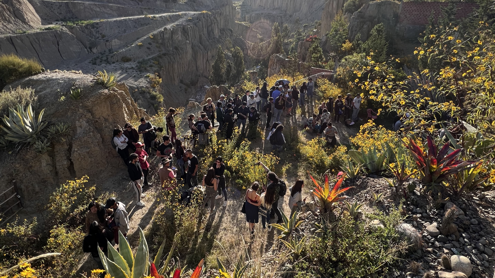

[Encuentro Nacional 4/20²⁶](./README.md) > Comunidad

# Comunidad

**Encuentro Nacional 4/20²⁶ Pro-Legalización 🌿**
*Celebración cultural replicable de ingreso y participación libre*

> 🌿 La comunidad 4/20 no empieza ni termina en este repositorio. Y no para en abril. Este repositorio puede ayudar a que esa comunidad se entienda mejor a sí misma, se articule con más claridad y se vuelva más visible sin perder su humanidad.

> 🌿 Para gran parte del público, una de las formas más útiles de ayudar en la estrategia pro-legalización es compartir todo lo referente al encuentro durante todo el año: links, posts, materiales, reflexiones y otras señales de que la conversación ya está viva.

## Qué entiende este proyecto por comunidad

Cuando aquí hablamos de **comunidad**, no nos referimos solo a un grupo de WhatsApp ni solo a personas que consumen cannabis.

Nos referimos a una red mucho más amplia y viva: personas que celebran el 4/20, que tienen curiosidad, que organizan, que difunden, que dudan, que observan, que hacen arte, que abren espacios, que transmiten en vivo, que firman el [pliego petitorio](./PETITION.md), que ayudan a sostener el encuentro o que simplemente reconocen que este tema ya forma parte de la vida cultural y social del país.

La comunidad 4/20 es más grande que cualquier evento, más grande que cualquier sede y más grande que esta propuesta específica.

## Dónde vive la comunidad real

La comunidad real vive primero en sus vínculos, en sus conversaciones y en sus formas de aparecer en el mundo.

Sus espacios más directos y activos viven en WhatsApp. La arquitectura tiene lógica propia:

**Chat general:**
[Chat 4/20²⁶ 🌿](https://chat.whatsapp.com/LGRvbEMEBZ8HruAqFBUoSE) — espacio amplio y abierto donde cualquiera puede compartir libremente lo que quiera relacionado con el movimiento. No es el hub central de trabajo post-evento — es un espacio de sharing.

**Puentes post-evento centrales:**
- [Cómo (y por qué) organizar un 4/20 🌿](https://chat.whatsapp.com/DoFrA1mNgShCiOW2X84DSn) — replicación, conversación y siguientes pasos hacia 4/20²⁷. Este grupo es el puente principal para quien quiere organizar, conocer la movida o contribuir a que crezca.
- [Aportes al Manual 4/20 🌿](https://chat.whatsapp.com/Fn2BXILT6Rj9TYdWgM7uF6) — canal principal para aportes de contenido al Manual 4/20 🌿.

**Grupos temáticos de apoyo:**
- [Orientación Medicinal 🌿](https://chat.whatsapp.com/IBKq1Bw3MjxKfaMYyjTGg8)
- [Orientación Legal 🌿](https://chat.whatsapp.com/JQYgV6zeIbzC6T0ryAnJPs)

**Grupos por departamento:**
[La Paz](https://chat.whatsapp.com/JCVnlJgnL78G7S3ejXSL52) · [Cochabamba](https://chat.whatsapp.com/Be6udeZmtBV6lGgMSsXAWz) · [Potosí](https://chat.whatsapp.com/HMNS1eCZ9bY36FcpFbT5Kp) · [Santa Cruz](https://chat.whatsapp.com/I9z6mOAEsfJ5wFHwNvvEer) · [Tarija](https://chat.whatsapp.com/DOEQk4gdyr10MIAmKNyQxa) · [Chuquisaca](https://chat.whatsapp.com/Jjkf5BeKZ99C482SEh6Gaj) · [Oruro](https://chat.whatsapp.com/L96GjiiFHhiL8TT36wcG5b)

El repositorio y el sitio existen para documentar, clarificar y fortalecer lo que la comunidad ya está haciendo, no para reemplazarla ni volverla artificialmente burocrática.

## La comunidad post-evento no espera hasta abril

Una de las apuestas importantes es que la comunidad no duerma entre ediciones.

Compartir información, eventos, materiales, reflexiones y señales de la movida 4/20 durante todo el año — no solo en abril — es parte de la estrategia de visibilización. Cada expresión pública, cada conversación, cada celebración que se suma ayuda a hacer el tema cada vez más presente e imposible de ignorar.

Algunos ejemplos de cómo puede sostenerse la comunidad durante el año:

- Compartir noticias o avances sobre políticas cannábicas, en Bolivia y en el mundo.
- Aportar al Manual 4/20 desde experiencia propia, salud, cultura o derecho.
- Organizar o visibilizar eventos 4/20 en territorios o espacios propios.
- Explorar la conversación sobre cómo y por qué organizar un 4/20.
- Sostener vínculos con personas y espacios que resonaron con el espíritu del encuentro.

## Capas de participación

Una de las intuiciones más importantes de este proyecto es que no toda participación tiene que verse igual.

Hay, al menos, varias capas posibles:

- Personas que asisten y hacen presencia.
- Personas que difunden el 4/20 y sus eventos.
- Espacios anfitriones que abren sede o se suman con bajo, medio o alto nivel de exposición.
- Artistas, panelistas y propuestas culturales que enriquecen el encuentro.
- Celebraciones virtuales que amplían el alcance del día.
- Aliados ocasionales que no se sienten parte del núcleo organizador, pero sí del movimiento cultural más amplio.
- Aportes temáticos al Manual 4/20, orientación legal u orientación medicinal.
- Voluntarios y organizadores que sostienen tareas concretas.

Esta estructura por capas evita un error frecuente: creer que la única manera válida de sumarse es "meterse de lleno" o exponerse demasiado. La comunidad también crece cuando se vuelve más porosa, más hospitalaria y más fácil de habitar desde distintos niveles.

## Eventos alineados y no alineados

No todos los eventos 4/20 tienen que estar totalmente alineados con esta propuesta para aportar a la visibilización cultural del día.

Este proyecto sí tiene una identidad propia: celebra el 4/20 desde una lógica cultural replicable, de ingreso y participación libre, con prudencia legal, hospitalidad y cuidado del espacio. Pero al mismo tiempo reconoce algo más amplio: mientras más visible se vuelve la comunidad 4/20 en la vida pública —a través de eventos, celebraciones, debates, arte, encuentros o transmisiones, estén o no alineados del todo con esta propuesta— más difícil se vuelve tratar el tema como si no existiera o no importara.

## Relación con Voluntariado Barranco

El encuentro 4/20 dialoga profundamente con el espíritu de [Voluntariado Barranco](https://voluntariado.barranco.life/).

El 4/20²⁶ en el Barranco confirmó algo: el cannabis no fue el centro social más profundo. El centro más hondo fue la manera alternativa de organizarnos — co-crear, adaptarnos, cuidar el espacio, colaborar, participar y estar juntos entre personas diversas.

Voluntariado Barranco busca cultivar durante todo el año esa misma posibilidad. Para quienes resonaron con ese espíritu más allá del cannabis, [Voluntariado Barranco](https://voluntariado.barranco.life/) es el puente natural.

## Para qué sirven los grupos

Los grupos de WhatsApp no son solo para anuncios o convocatorias. También son un recurso activo para quien necesita orientación.

Si alguien tiene dudas sobre la organización de un 4/20, quiere saber cómo funciona el modelo del Barranco, tiene preguntas sobre la Ley 1008, quiere aportar información al Manual 4/20 🌿 o simplemente quiere conectar con personas que ya vivieron el proceso — los grupos son el lugar.

- Dudas sobre organización → [Chat 4/20²⁶ 🌿](https://chat.whatsapp.com/LGRvbEMEBZ8HruAqFBUoSE) o el grupo de su departamento
- Dudas o info legal → [Orientación Legal 🌿](https://chat.whatsapp.com/JQYgV6zeIbzC6T0ryAnJPs)
- Info medicinal o de salud → [Orientación Medicinal 🌿](https://chat.whatsapp.com/IBKq1Bw3MjxKfaMYyjTGg8)
- Aportes al manual → [Aportes al Manual 4/20 🌿](https://chat.whatsapp.com/Fn2BXILT6Rj9TYdWgM7uF6)
- Replicar o planear un 4/20 → [Cómo (y por qué) organizar un 4/20 🌿](https://chat.whatsapp.com/DoFrA1mNgShCiOW2X84DSn)

La idea es que quien llega a estos grupos encuentre orientación real, no solo silencio o mensajes de difusión.

## Cómo sumarse sin complicarlo todo

No hace falta entrar a una estructura rígida para formar parte de esta comunidad.

Hoy, una persona, proyecto o espacio puede sumarse de muchas maneras:

- Entrando al [Chat 4/20²⁶ 🌿](https://chat.whatsapp.com/LGRvbEMEBZ8HruAqFBUoSE).
- Sumándose al grupo de su territorio.
- Aportando al [Manual 4/20 🌿](https://manual420.barranco.life) desde [Aportes al Manual 4/20 🌿](https://chat.whatsapp.com/Fn2BXILT6Rj9TYdWgM7uF6).
- Conversando sobre cómo organizar un 4/20 desde [Cómo (y por qué) organizar un 4/20 🌿](https://chat.whatsapp.com/DoFrA1mNgShCiOW2X84DSn).
- Compartiendo un evento propio del 4/20 para visibilizarlo.
- Ayudando a abrir conversación con personas escépticas o no consumidoras.
- Sumándose a [Voluntariado Barranco](https://voluntariado.barranco.life/) si el espíritu más profundo del Barranco resonó.

## Cuidado del tono y la convivencia

Si la comunidad quiere crecer y volverse cada vez más visible, importa también cómo habla, cómo se presenta y cómo cuida sus espacios.

Eso implica, entre otras cosas:

- Evitar reducir el tema a consignas vacías o reacción automática.
- No asumir que todo el mundo ya está convencido.
- Abrir espacio también a curiosos, escépticos y público general.
- Cuidar el trato entre personas, tanto online como presencialmente.
- No romantizar desorden, imprudencia o negligencia como si fueran sinónimos de libertad.
- Entender que una comunidad más visible también necesita volverse más legible para la sociedad en general.

Y también importa recordar algo básico: _el encuentro no promueve vulnerar la Ley 1008; la responsabilidad es individual_.

## Relación con otros documentos

- [Página principal del encuentro](./README.md)
- [Cómo contribuir](./CONTRIBUTE.md)
- [Espacios anfitriones](./SPACES.md)
- [Mapa de participación y convocatorias](./PARTICIPATE.md)
- [Historia y aprendizajes](./HISTORY.md)
- [Manual 4/20 🌿](https://manual420.barranco.life)
- [Voluntariado Barranco](https://voluntariado.barranco.life/)

La comunidad no crece solo porque más gente entre a un grupo. Crece cuando encuentra mejores formas de aparecer, cuidarse, orientarse por territorio y volverse cada vez más legible para la vida pública del país.
