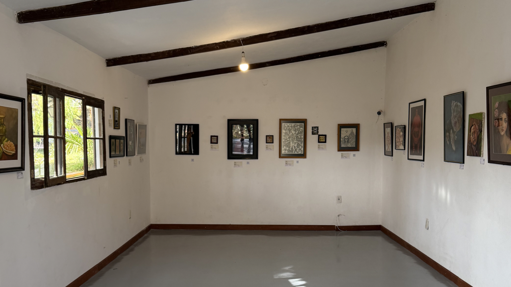

[4/20²⁶ 🌿](./README.md) > Artistas Visuales / Expo

# Artistas Visuales / Expo

**Encuentro Nacional 4/20²⁶ Pro-Legalización 🌿**  
*Celebración cultural replicable de ingreso y participación libre*

> 🌿 Una expo puede ser una de las formas más amables y potentes de abrir el encuentro a público general, escépticos y personas que quizá no se acercarían primero por otra puerta.

> ℹ️ La convocatoria específica para [artistas visuales / expo](https://forms.gle/REPLACE_ME_EXHIBITION_FORM) ya está abierta. Este documento deja claro el espíritu general, para que artistas, curadores y espacios puedan imaginar mejor las colaboraciones posibles.

## Qué lugar tienen la expo y las artes visuales en el encuentro

Las artes visuales pueden ayudar a que una sede se vuelva más hospitalaria, legible y abierta a distintas sensibilidades.

No se piensan solo como decoración o acompañamiento. También pueden ayudar a:

- Abrir el encuentro a un público más amplio.
- Desestigmatizar desde la experiencia estética y no solo desde el discurso.
- Crear una puerta de entrada para personas curiosas, escépticas o no consumidoras.
- Sostener una presencia del encuentro más allá del 20 de abril.
- Volver más fácil que un espacio se anime a sumarse desde una modalidad culturalmente defendible.

En muchos casos, una expo puede ser la forma más natural de participar para una galería, café, casa cultural o espacio mixto.

## Cómo se entiende la participación visual

La participación visual, como la del público, la del espacio anfitrión y la de otras propuestas del encuentro, se piensa en principio como **voluntaria**.

Eso ayuda a mantener el espíritu general del proyecto, reduce riesgos innecesarios y deja claro que se trata de una red abierta donde muchas cosas brotan porque alguien decide sumarse, no solo porque existe una contratación cerrada entre partes.

Al mismo tiempo, eso no significa que un artista o una sede tengan que salir perdiendo.

Si una muestra necesita transporte, montaje, cuidado especial, impresión, materiales o alguna logística que excede lo razonable, la idea es que eso pueda hablarse con claridad. Cuando haga sentido, se buscará junto a la [comunidad](https://chat.whatsapp.com/KvN6wsDnoLR1ytdLJI3m00) y al [espacio anfitrión](./SPACES.md) la mejor forma de cubrir o aliviar esos costos.

## Qué tipo de propuestas visuales podrían sumarse

La invitación está abierta, por ejemplo, a:

- Pintura
- Ilustración
- Fotografía
- Escultura u objeto
- Instalación
- Video o proyección
- Intervención visual temporal
- Muestra colectiva
- Obras en proceso o de pequeño formato
- Otras formas visuales que hagan sentido con el espíritu del [encuentro](./README.md)

Lo importante no es encajar en una categoría perfecta, sino aportar a una experiencia cuidada, hospitalaria y con identidad propia.

## Qué puede hacer posible una expo para un espacio que se suma

Una sede que se abre al encuentro no necesariamente tiene que imaginar solo música o una jornada intensa de un solo día.

Dependiendo del espacio, una propuesta visual puede hacer posible:

- Una participación de menor riesgo y mayor duración.
- Una puerta de entrada más amable para público general.
- Una presencia del encuentro antes, durante y después del 20.
- Una forma de activar comunidad sin exigir una producción grande.
- Una colaboración entre artistas, espacio y voluntariado que se parezca a ser [voluntariado por un día](https://voluntariado.barranco.life/Actividades/A%C3%B1o_Nuevo.html): una pequeña prueba de lo que puede hacer posible una comunidad cuando se organiza con claridad, sensibilidad y propósito compartido.

Eso no significa prometer resultados automáticos. Significa dejar abierta una posibilidad real y muy fértil.

## Lo general y lo particular de cada sede

No todos los espacios tienen que organizar una expo del mismo modo.

Hay decisiones que pueden variar según cada sede, por ejemplo:

- Hacer una muestra solo por el día del encuentro.
- Mantener la expo algunos días o semanas más.
- Invitar a un solo artista o a varios.
- Tener obras ya terminadas o abrir procesos más experimentales.
- Cubrir o no algunos costos logísticos concretos.
- Combinar expo con música, coloquio, feria o encuentro comunitario.

La idea no es volver excluyente el encuentro por fijar un solo modelo, sino sumar posibilidades. Cada espacio puede adaptar estos lineamientos según su realidad, sabiendo que mientras más se aparte del espíritu general, más entra en decisiones propias y menos en una lógica ya probada por la experiencia compartida del [encuentro](./README.md).

## Caso particular: Proyecto Cultural Barranco

En [Proyecto Cultural Barranco](https://barranco.life), la referencia actual para este año es volver a abrir la [galería](https://www.instagram.com/galeria.barranco) como una de las puertas vivas del encuentro.

La idea es inaugurar la exposición el **sábado 18 de abril** y mantenerla abierta por **al menos un mes**, de modo que el encuentro no respire solo el día central, sino que deje también una presencia más duradera en el espacio.

Eso puede ayudar a:

- Darle al proyecto una dimensión más abierta a público general.
- Invitar a personas que quizá entrarían primero por el arte y no por otras capas del encuentro.
- Sostener conversación y visitas más allá del día central.
- Mostrar a otros espacios una forma concreta en que una sede puede sumarse sin depender solo de música o feria.

En el caso del Barranco, la lógica propuesta es que si una obra se vende, **la venta sea para el artista**, con un aporte sugerido al espacio a criterio suyo.

También, específicamente el **20 de abril**, la idea es que la galería funcione como *open deck* para artistas musicales, en diálogo con [Artistas y Música](./ARTISTS.md), procurando siempre cuidar las obras y el espacio.

La intención es que eso se viva con criterio, cuidado y respeto. Aun así, si ocurriera algún daño, el espacio no puede asumir de entrada una responsabilidad automática por destrozos o descuidos individuales. En situaciones extremas, la idea sería conversar y buscar una salida razonable junto a la comunidad y, si hiciera falta, con [Voluntariado Barranco](https://voluntariado.barranco.life/).

No se presenta como modelo obligatorio. Se presenta como un caso vivo de referencia.

## Qué puede aportar el encuentro a artistas visuales y espacios

Así como un [espacio](./SPACES.md) puede abrirse a una nueva comunidad, también una propuesta visual puede encontrar aquí:

- Un contexto cultural distinto al circuito habitual.
- Un público nuevo.
- Una conversación menos rígida y más viva.
- La posibilidad de dialogar con música, naturaleza, comunidad y encuentro.
- Un primer puente con espacios que luego quizá quieran seguir programando arte, muestras o colaboraciones.

## Qué se valora en una propuesta visual

Más allá del formato, se valora especialmente:

- Cuidado del espacio.
- Buena disposición para coordinar montaje y tiempos.
- Apertura a formatos proporcionales al lugar.
- Comprensión del contexto cultural y legal.
- Voluntad de aportar a una experiencia hospitalaria, no solo a una exhibición aislada.

## Relación con otros documentos

Este archivo dialoga especialmente con:

- [Espacios Anfitriones](./SPACES.md)
- [Artistas y Música](./ARTISTS.md)
- [Participar](./PARTICIPATE.md)
- [Página principal del encuentro](./README.md)
- [Manual 4/20 🌿](https://manual420.barranco.life)
- [4/20²⁶ 🪴](https://chat.whatsapp.com/KvN6wsDnoLR1ytdLJI3m00)
- [Proyecto Cultural Barranco (Maps)](https://goo.gl/maps/iWB6R5HZnREL7ALKA)
- [Voluntariado Barranco](https://voluntariado.barranco.life/)

Una expo puede ser una de las formas más suaves y duraderas de hacer visible el encuentro. No la única. Pero sí una de las más hospitalarias para abrir conversación, sensibilidad y comunidad.
