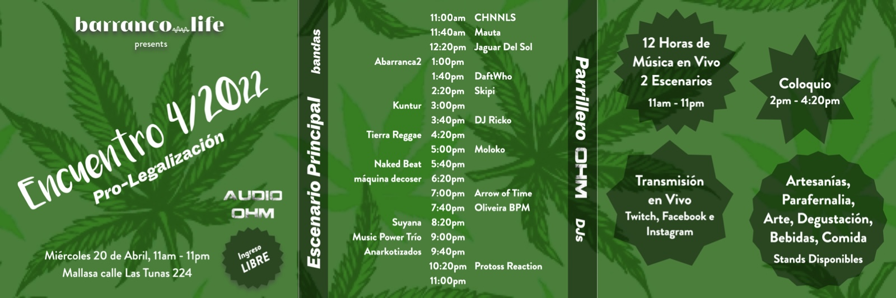
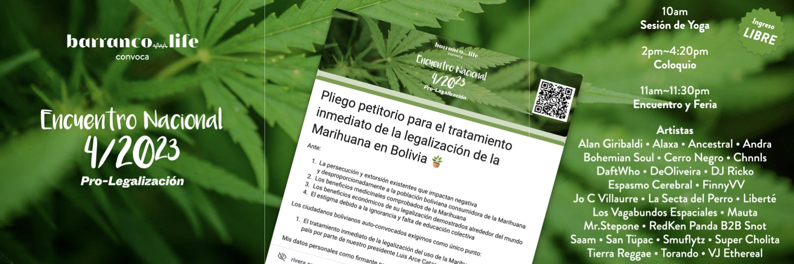
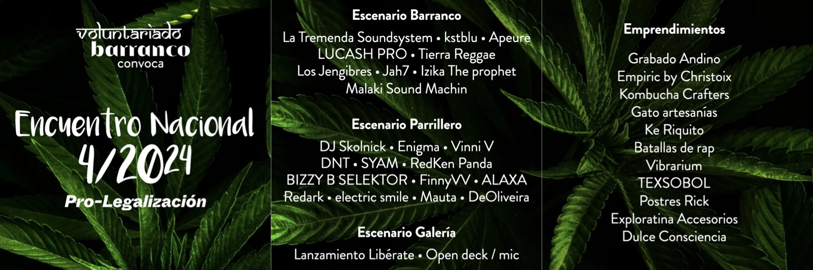
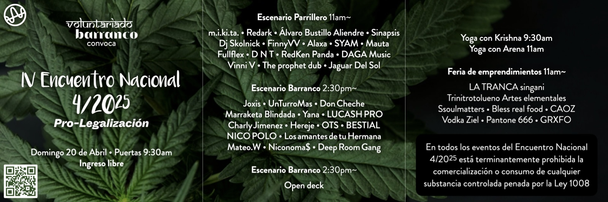

[4/20²⁶ 🌿](./README.md) > Historia y Aprendizajes

# Historia y Aprendizajes

**Encuentro Nacional 4/20²⁶ Pro-Legalización 🌿**  
*Celebración cultural replicable de ingreso y participación libre*

> 🌿 Esta historia no busca inflarse ni volverse nostalgia vacía. Busca registrar, de forma útil y legible, cómo fue madurando en Proyecto Cultural Barranco un modelo de eventos 4/20 que hoy empieza a abrirse como infraestructura replicable para otros espacios.

> 🌿 Mirar hacia atrás no sirve solo para recordar. Sirve para distinguir qué funcionó, qué tensiones aparecieron y qué capas del encuentro fueron encontrando su forma con los años.

> *Día central 2026:* *lunes 20 de abril de 2026*.
>
> *Actividades opcionales:* viernes 17 al domingo 19, según cada espacio.
>
> *Nota electoral:* en Oruro, Beni, Chuquisaca, Tarija y Santa Cruz la segunda vuelta del domingo 19 de abril condiciona fuertemente cualquier actividad pública ese fin de semana. El día de la votación no debe contarse como fecha útil para actividad pública, y por prudencia el foco allí debería ponerse especialmente en el lunes 20 o en formatos muy cuidados.

## Qué busca registrar este archivo

Este documento no busca construir una historia heroica del encuentro. Busca registrar, de manera útil y legible, cómo fue madurando esta experiencia y qué aprendizajes dejó en el camino.

No todo aquí está cerrado ni cuantificado con precisión perfecta. Algunas cosas podrán afinarse con nuevos recuerdos, materiales, fotos, formularios, publicaciones o testimonios. Aun así, ya existe suficiente experiencia acumulada como para dejar una primera línea histórica clara.

## Por qué importa esta historia

El Encuentro Nacional 4/20²⁶ 🌿 no aparece de la nada. Viene de varios años de prueba, intuición, errores, hallazgos, comunidad y organización real en torno al 20 de abril, especialmente desde [Proyecto Cultural Barranco](https://barranco.life).

Esta historia importa porque muestra que el proyecto no es solo una idea o una campaña anual. Es el resultado de celebraciones que ya ocurrieron, aprendizajes que costaron experiencia real y una pregunta que fue cambiando de forma: cómo hacer visible esta cultura de una manera cada vez más humana, más madura y más difícil de reducir a prejuicios.

También importa porque deja ver algo más preciso: en el Barranco fue surgiendo, año tras año, un cierto **modelo de evento**. No apareció completo desde el inicio. Fue emergiendo por capas: música, feria, emprendimientos, coloquio, transmisión, yoga, open deck, pliego, protocolo, comunidad y una forma cada vez más clara de cuidar el espacio sin apagar la celebración. Replicar eventos 4/20 en distintas ciudades no es un detalle logístico: es parte de la estrategia del movimiento, y esta historia ayuda a mostrar de dónde salió esa intuición.

## 2022 · Primer gran encuentro en Proyecto Cultural Barranco

El encuentro de 4/20²² fue el primer gran hito del proceso. Cayó en un día laboral y, aun así, reunió a una cantidad muy significativa de personas en **Proyecto Cultural Barranco**.

La memoria general del proceso lo recuerda como un día de alta intensidad comunitaria, con más de mil asistentes, dos escenarios, bandas, DJs, feria y un coloquio que incluyó también voces externas y participantes remotos. Más allá del número exacto final, lo importante es que dejó una evidencia clara: el 4/20 podía convocar de forma transversal, potente y culturalmente rica.

Ese año todavía pesaba más una lógica de “gran encuentro” que una lógica de red replicable o territorial. Pero ya estaban presentes varias semillas de lo que vendría después:

- La mezcla entre música, feria, conversación y comunidad.
- La posibilidad de abrir el espacio a perfiles muy distintos.
- La transmisión como forma de ampliar alcance más allá de quienes estaban físicamente allí.
- La percepción de que el 4/20 no tenía por qué limitarse a prejuicios o reducciones simplistas sobre el consumo.
- La intuición de que había algo socialmente valioso en la forma en que la gente se reunía ese día.

También fue importante porque el coloquio todavía giraba bastante en torno a justificar la legalización ante gente que, en gran medida, ya estaba convencida. Ese límite se volvería más claro con el tiempo.

## 2023 · Pliego, yoga, coloquio y una estructura más explícita

El encuentro de 2023 muestra un paso importante en la maduración del formato. Para entonces, la estructura ya aparecía más articulada: no solo había música y encuentro comunitario, sino también una capa más visible de bienestar, conversación pública, feria y dimensión ciudadana.

Ese giro no es menor. 2023 no solo consolidó música y encuentro comunitario: también empezó a hacer más explícita una dimensión ciudadana y documental del proyecto.

Aquí aparece uno de los aprendizajes más valiosos del proceso: el **plan de contingencia / protocolo de seguridad**. La experiencia dejó claro que no bastaba con “abrir el espacio” y confiar en la buena voluntad general. Si la propuesta quería sostenerse en Bolivia sin caer en ingenuidad, necesitaba reglas, señalización, criterios de ingreso, prudencia legal y una forma de actuar ante situaciones delicadas.

Ese aprendizaje cambió el rumbo del proyecto.

También empezó a hacerse más visible otra intuición importante: si el encuentro quería crecer de verdad, no bastaba con repetir una fecha en un solo lugar. Hacía falta empezar a pensar en documentación, capas replicables y otras posibles sedes.

Ese aprendizaje cambió el rumbo del proyecto. Empezó a volverse evidente que el valor del encuentro no estaba solo en reunir gente, sino en demostrar que un 4/20 podía organizarse con más cuidado, más claridad y más responsabilidad de lo que muchos suponían.

También dejó otra lección importante: no toda expansión es buena por sí sola. Ya entonces se hizo visible que crecer sin suficiente base, sin contención o sin alineación real podía salir caro. Ese aprendizaje sigue siendo central hoy.

## 2024 · Tres escenarios, open deck y una celebración más habitable

El ciclo 2024 ayudó a sostener la continuidad del encuentro y a mostrar una forma todavía más habitable y diversa del modelo Barranco. Para entonces ya se sentía con más claridad una lógica de capas simultáneas dentro del espacio, no solo una programación lineal.

Eso importa mucho porque muestra cómo el encuentro empezó a abrir más capas internas del espacio: no solo escenario principal y zona de DJs, sino también una tercera puerta más flexible, más experimental y más comunitaria. A la vez, se iba confirmando otra intuición del proceso: una celebración se vuelve más hospitalaria cuando no depende solo de la música, sino también de circulación, feria, descanso, conversación y permanencia.

Entre otras cosas, 2024 ayudó a consolidar preguntas importantes:

- Cómo evitar que el 4/20 quede reducido a una sola jornada aislada.
- Cómo aprovechar mejor la fuerza comunitaria que aparece ese día.
- Cómo abrirse a más perfiles sin perder prudencia ni cohesión.
- Cómo hacer que la experiencia deje algo más que una memoria simpática o intensa.

En perspectiva, 2024 parece menos importante por una sola innovación espectacular y más por haber hecho más legible una forma de celebración compleja: con música, emprendimientos, capas simultáneas y una comunidad que seguía autorregulándose dentro de un espacio cuidado. Esa legibilidad importa mucho porque es parte de lo que luego permite pensar el modelo como algo que podría compartirse, documentarse y brotar también en otros lugares.

## 2025 · Cuatro ediciones, yoga, open deck y un modelo más reconocible

La edición 2025 muestra quizá con más nitidez el tipo de evento que fue emergiendo en el Barranco. A esa altura, el formato ya se sentía más reconocible: una jornada larga, con varias capas de actividad, distintas puertas de entrada y una convivencia más clara entre música, bienestar, feria y comunidad.

También se vuelve más visible otra evolución del modelo: la comunicación pública ya no solo convoca; también protege al espacio y ayuda a sostener la legitimidad cultural y organizativa del evento.

En 2025 el proyecto ya mostraba una estructura más compleja y explícita. Los formularios de participación de ese año revelan varias capas que hoy siguen siendo clave:

- **Espacios** como sedes posibles del encuentro.
- **Artistas** como capa cultural viva.
- **Panelistas** para conversación pública.
- **Emprendimientos** como parte de la feria o circulación del evento.
- **Pliego petitorio** como dimensión ciudadana más formal.

También se fue volviendo más clara la idea de comunidad por capas: no solo asistentes, sino artistas, emprendimientos, panelistas, espacios, personas que difunden, personas que aportan al manual y distintas formas de participación con distintos niveles de exposición.

Ese año también quedó más clara la idea de que podían existir distintos tipos de sedes, incluyendo modalidades más discretas y niveles de riesgo distintos. Y empezó a tomar forma la noción de que el proyecto ya no era solo “el 4/20 del Barranco”, sino algo con capacidad de convertirse en red, en metodología y en documentación replicable.

Al mismo tiempo, se hizo evidente que el enfoque todavía arrastraba parte de una lógica más centrada en “hacer ruido” y “cambiar el mundo” desde una postura de empuje. Esa energía ayudó a mover cosas, pero también mostró sus límites. El giro 2026 nace, en parte, de reconocer eso con honestidad y de querer ir hacia algo más profundo, más alineado y menos reactivo.

## Lo que fue quedando claro

Con el paso de los años, varias cosas empezaron a volverse difíciles de ignorar:

- Que el 4/20 sí puede convocar una comunidad espontánea, diversa y sorprendentemente autorregulada.
- Que el verdadero valor no está solo en el discurso político, sino en la experiencia social que el encuentro vuelve visible.
- Que la legalización quizá se acerca mejor desde una estrategia de visibilización y desestigmatización cultural sostenida que desde la confrontación permanente.
- Que mientras más visible se vuelve la comunidad 4/20 en la vida cultural y social del país —a través de encuentros, celebraciones, debates, expresiones artísticas y otros eventos, estén o no alineados con esta propuesta— más difícil se vuelve tratar el tema como si no existiera o no importara.
- Que los **espacios anfitriones** son una de las claves más importantes del modelo, pero no la única.
- Que replicar eventos 4/20 en distintas ciudades no es un detalle logístico, sino una parte central de la estrategia de visibilización y desestigmatización.
- Que el **plan de contingencia** es uno de los activos más valiosos construidos por experiencia real.
- Que no todo tiene que ocurrir igual en todas las sedes.
- Que el 4/20 puede abrir puertas a arte, feria, conversación pública, virtualidad, documentación y comunidad más allá de una sola fecha.
- Que parte de la energía más bella de ese día podría cultivarse el resto del año.

## Qué cambia en 2026

La edición 2026 no es solo una nueva edición. Es un cambio de etapa.

El proyecto pasa de parecerse más a una campaña o a un gran evento anual, a entenderse como una **infraestructura abierta para celebraciones culturales replicables**, con:

- [Proyecto Cultural Barranco](https://barranco.life) como caso de referencia documentado.
- [Voluntariado Barranco](https://voluntariado.barranco.life/) como puente filosófico y organizativo.
- Grupos de WhatsApp por departamento y capas temáticas de apoyo como parte de una comunidad más legible y territorial.
- **Espacios anfitriones** como centro estratégico de expansión, dentro de una estructura ya abierta también a otras formas de participación.
- **Ingreso y participación libre** como principio cultural.
- **Prudencia legal y protocolo de seguridad** como base de sostenibilidad.
- [**Manual 4/20 🌿**](https://manual420.barranco.life) como capa de contexto, memoria y educación.
- **Pliego petitorio** como dimensión ciudadana abierta a contribuciones.

También cambia el tono y la estrategia: menos búsqueda de choque, más hospitalidad; menos reacción, más ejemplo; menos obsesión por empujar una postura, más interés en mostrar una posibilidad social difícil de reducir a prejuicios. La apuesta es que, mientras la comunidad 4/20, sus celebraciones, sus expresiones culturales y el propio debate se vuelvan cada vez más visibles en la vida pública, más probable será que el tema se consolide como asunto de interés general. No se trata de insistir solo desde la confrontación, sino de volver esta realidad cada vez más legible, presente e imposible de ignorar en la experiencia social del país. Y para eso, replicar eventos 4/20 en distintas ciudades, con distintas escalas y capas, deja de ser un detalle operativo: se vuelve parte central de la estrategia.

## Relación con otros documentos

Este archivo dialoga especialmente con:

- [Página principal del encuentro](./README.md)
- [Espacios anfitriones](./SPACES.md)
- [Cómo contribuir](./CONTRIBUTE.md)
- [Mapa de participación y convocatorias](./PARTICIPATE.md)
- [Artistas y Música](./ARTISTS.md)
- [Artistas Visuales / Expo](./EXHIBITION.md)
- [Colloquium](./COLLOQUIUM.md)
- [Emprendimientos](./VENTURES.md)
- [Participación Virtual](./VIRTUAL.md)
- [Pliego petitorio](./PETITION.md)
- [Comunidad](./COMMUNITY.md)
- [Manual 4/20 🌿](https://manual420.barranco.life)

La historia del encuentro no está terminada. Pero ya dejó suficientes señales como para decir algo importante: esto no nació ayer, no apareció de la nada y no depende solo de una consigna. También dejó una intuición estratégica cada vez más clara: que hacer visible esta cultura en más ciudades, más espacios y más capas puede ser una de las formas más fértiles de volver la legalización una conversación imposible de ignorar.
