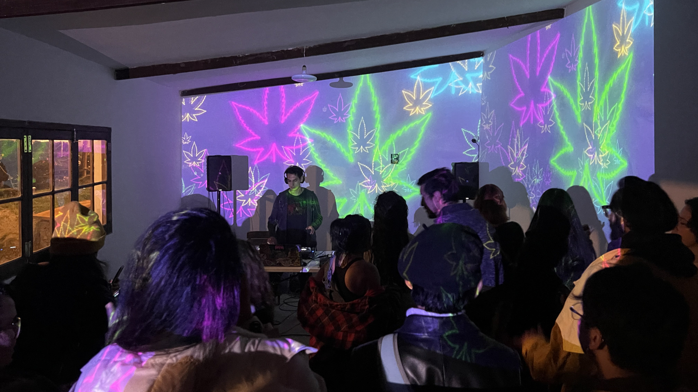

[4/20²⁶ 🌿](./README.md) > Participar

# Participar

**Encuentro Nacional 4/20²⁶ Pro-Legalización 🌿**  
*Celebración cultural replicable de ingreso y participación libre*

> 🌿 Participar no es solo asistir o actuar. También puede ser alojar, difundir, observar, proponer, transmitir, documentar o ayudar a que otras personas se animen.

> 🌿 Para gran parte del público, una de las mejores formas de ayudar en la estrategia pro-legalización es compartir todo lo referente al encuentro: links, posts, transmisiones, convocatorias y otras señales de que la conversación ya está viva.

> *Día central 2026:* *lunes 20 de abril de 2026*.
>
> *Actividades opcionales:* viernes 17 al domingo 19, según cada espacio.
>
> *Nota electoral:* en [Oruro](https://chat.whatsapp.com/L96GjiiFHhiL8TT36wcG5b), Beni, [Chuquisaca](https://chat.whatsapp.com/Jjkf5BeKZ99C482SEh6Gaj), [Tarija](https://chat.whatsapp.com/DOEQk4gdyr10MIAmKNyQxa) y [Santa Cruz](https://chat.whatsapp.com/I9z6mOAEsfJ5wFHwNvvEer), la segunda vuelta del domingo 19 de abril condiciona fuertemente cualquier actividad pública ese fin de semana. El día de la votación no debe contarse como fecha útil para actividad pública, y por prudencia el foco allí debería ponerse especialmente en el lunes 20 o en formatos muy cuidados.

## Cómo se puede participar

El encuentro está abierto a muchas formas de participación. No todas requieren el mismo nivel de exposición, tiempo o compromiso.

La idea es simple: abrir distintas puertas de entrada para que cada persona, espacio o comunidad encuentre una forma realista de sumarse.

Replicar eventos 4/20 en distintas ciudades no es un detalle logístico: es parte de la estrategia del movimiento. Cada espacio, artista, emprendimiento, transmisión o aporte que se suma ayuda a visibilizar la comunidad, desestigmatizar el cannabis y convertir la legalización en una conversación cada vez más presente en la vida pública boliviana.

Eso puede incluir, por ejemplo:

- Abrir o proponer un [espacio anfitrión](./SPACES.md).
- Firmar o enriquecer el [pliego petitorio](./PETITION.md).
- Sumarse desde [artistas y música](./ARTISTS.md).
- Proponer una [expo o participación visual](./EXHIBITION.md).
- Participar en [colloquium](./COLLOQUIUM.md).
- Sumarse desde [emprendimientos](./VENTURES.md).
- Participar o asistir desde la capa [virtual](./VIRTUAL.md).
- Compartir links, posts, transmisiones y convocatorias.
- Ayudar a tender puentes con artistas, espacios, prensa, colectivos o personas interesadas.

No hace falta encajar de inmediato en una categoría cerrada. Si una propuesta tiene sentido para el espíritu del encuentro, se puede conversar, ubicar mejor y, si hace falta, abrir una modalidad nueva.

## Convocatorias activas ahora

En esta fase el encuentro ya está abierto a múltiples formas principales de participación: espacios, pliego, artistas y música, artistas visuales / expo, panelistas, emprendimientos y capa virtual.

También ya está activa la capa comunitaria en WhatsApp, con un [chat general](https://chat.whatsapp.com/LGRvbEMEBZ8HruAqFBUoSE), grupos por departamento y grupos temáticos de apoyo como [Aportes al Manual 4/20 🌿](https://chat.whatsapp.com/Fn2BXILT6Rj9TYdWgM7uF6), [Orientación Medicinal 🌿](https://chat.whatsapp.com/IBKq1Bw3MjxKfaMYyjTGg8) y [Orientación Legal 🌿](https://chat.whatsapp.com/JQYgV6zeIbzC6T0ryAnJPs).

Estado actual de espacios:
- Confirmados 🟢: [La Paz](https://chat.whatsapp.com/JCVnlJgnL78G7S3ejXSL52), [Cochabamba](https://chat.whatsapp.com/Be6udeZmtBV6lGgMSsXAWz)
- A Confirmarse 🟡: [Potosí](https://chat.whatsapp.com/HMNS1eCZ9bY36FcpFbT5Kp)
- Buscando Espacios ⚪️: [Santa Cruz](https://chat.whatsapp.com/I9z6mOAEsfJ5wFHwNvvEer), [Tarija](https://chat.whatsapp.com/DOEQk4gdyr10MIAmKNyQxa)
- Abiertos a Propuestas ⚪️: [Oruro](https://chat.whatsapp.com/L96GjiiFHhiL8TT36wcG5b), Beni, [Chuquisaca](https://chat.whatsapp.com/Jjkf5BeKZ99C482SEh6Gaj), Pando

### Espacios anfitriones

La convocatoria para [espacios anfitriones](./SPACES.md) sigue siendo una de las puertas más importantes del encuentro, pero ya no es la única: en esta fase también están abiertas las demás formas principales de participación. Replicar eventos 4/20 en distintas ciudades es una parte central de la estrategia del movimiento.

Esto incluye, por ahora:
- Espacios anfitriones públicos.
- Locaciones secretas.
- Puntos de apoyo o difusión.
- Celebraciones o transmisiones virtuales.
- Otras formas compatibles con el espíritu del encuentro, aunque todavía no estén formalizadas como categoría propia.

**Formulario activo:** [Espacios Anfitriones](https://forms.gle/9KaoCBb7iaB3PV6x8)

### Pliego petitorio

Ya está abierta también la posibilidad de firmar y aportar al [pliego petitorio](./PETITION.md).

La idea no es tratarlo como un texto cerrado o definitivo, sino como un documento que pueda madurar con aportes ciudadanos, culturales, jurídicos, médicos y comunitarios. También queremos que dialogue cada vez mejor con el [Manual 4/20 🌿](https://manual420.barranco.life).

**Formulario activo:** [Pliego Petitorio](https://forms.gle/96XH81TFQrCX1R7U6)

### Artistas y música

La convocatoria para [artistas y música](./ARTISTS.md) ya está abierta para DJs, bandas, músicos y otros formatos sonoros o escénicos que quieran sumarse a una sede anfitriona o a la red general del encuentro.

La intención es cuidar mejor las condiciones de participación cuando haya necesidades reales de transporte, logística o apoyo técnico. Cuando aparece un espacio, muchas veces la comunidad empieza a articularse bastante orgánicamente: se suman artistas, emprendimientos, apoyo para armar, difusión y gente que quiere aportar de una u otra manera.

**Formulario activo:** [Artistas y Música](https://forms.gle/jfiZqSWUhqTDG45C8)

### Artistas visuales / expo / galería

La convocatoria para [artistas visuales / expo](./EXHIBITION.md) ya está abierta para artistas plásticos, visuales, fotógrafos, ilustradores, videastas y otras propuestas expositivas.

Nos interesa especialmente abrir espacio a obras que puedan habitar una galería o muestra más allá del 20 de abril, incluyendo posibles actividades previas el fin de semana anterior cuando el contexto local lo permita. Esta es una de las puertas más importantes para abrir el encuentro a público general, curiosos y escépticos.

**Formulario activo:** [Artistas Visuales / Expo](https://forms.gle/FRbBrQBWWF9WhNSh6)

### Panelistas / coloquio / conversación pública

La convocatoria para [colloquium](./COLLOQUIUM.md) ya está abierta para personas interesadas en aportar a conversaciones útiles y maduras sobre el momento actual del tema.

No buscamos repetir una discusión cerrada entre personas ya convencidas. Nos interesa más abrir conversación sobre desestigmatización, libertad con límites, organización prudente, hospitalidad cultural, estrategias de visibilización no confrontacional y aprendizajes que puedan alimentar el [Manual 4/20 🌿](https://manual420.barranco.life).

Esta participación puede ser **presencial o virtual**.

**Formulario activo:** [Panelistas y conversación pública](https://forms.gle/Ufv8JDgU3FvjaAru9)

### Emprendimientos

La convocatoria para [emprendimientos](./VENTURES.md) ya está abierta para propuestas que quieran participar en ferias o espacios de circulación pública dentro del encuentro, siempre dentro de un marco prudente y compatible con la legislación vigente.

La idea no es abrir una vitrina sin criterio, sino sumar propuestas coherentes con el espíritu cultural y organizativo del encuentro.

**Formulario activo:** [Emprendimientos](https://forms.gle/3rUdi5U3ALktPdE86)

### Participación virtual

La capa [virtual](./VIRTUAL.md) ya puede tomar forma desde varios lugares: artistas, espacios y panelistas pueden indicar en sus propios formularios si su participación será también virtual o remota.

Además, para muchas personas esta será también una forma de asistir: mirando, acompañando y compartiendo transmisiones, links y publicaciones del encuentro. También puede ser especialmente valiosa en departamentos donde el contexto electoral haga más prudente reducir la apuesta presencial antes del lunes 20. La idea es transmitir por [Instagram](http://instagram.com/barranco.life), [Twitch](http://twitch.tv/barranco_life), [Facebook](https://facebook.com/barranco.life) y/o [TikTok](https://www.tiktok.com/@barranco.life), según cómo se vaya organizando la cobertura del día.

**Formularios relacionados:** [Artistas y Música](https://forms.gle/jfiZqSWUhqTDG45C8), [Espacios Anfitriones](https://forms.gle/9KaoCBb7iaB3PV6x8) y [Panelistas y conversación pública](https://forms.gle/Ufv8JDgU3FvjaAru9)

## Otras formas de sumarse

El encuentro también está abierto a formas de participación que no siempre entran en un formulario clásico.

Ejemplos posibles:
- Celebrar el 4/20 a su manera y notificarnos o taggearnos para compartirlo.
- Recomendar una sede posible.
- Ayudar a tender puentes con prensa, artistas, colectivos o espacios aliados.
- Compartir gráficas, estados, historias, links, posts o transmisiones del encuentro.
- Difundir eventos oficiales y también otros eventos 4/20 que ayuden a volver más visible la comunidad, la fecha y el debate en la vida pública.
- Proponer una categoría nueva que todavía no haya sido considerada.
- Aportar ideas, materiales o aprendizajes que luego puedan fortalecer el [Manual 4/20 🌿](https://manual420.barranco.life).

Si algo no encaja todavía en una convocatoria formal, WhatsApp puede ayudar a ubicarlo mejor según territorio o interés:
- [Chat general 4/20²⁶ 🌿](https://chat.whatsapp.com/LGRvbEMEBZ8HruAqFBUoSE)
- [La Paz 4/20²⁶ 🟢](https://chat.whatsapp.com/JCVnlJgnL78G7S3ejXSL52)
- [Cochabamba 4/20²⁶ 🟢](https://chat.whatsapp.com/Be6udeZmtBV6lGgMSsXAWz)
- [Potosí 4/20²⁶ 🟡](https://chat.whatsapp.com/HMNS1eCZ9bY36FcpFbT5Kp)
- [Santa Cruz 4/20²⁶ ⚪️](https://chat.whatsapp.com/I9z6mOAEsfJ5wFHwNvvEer)
- [Tarija 4/20²⁶ ⚪️](https://chat.whatsapp.com/DOEQk4gdyr10MIAmKNyQxa)
- [Chuquisaca 4/20²⁶ ⚪️](https://chat.whatsapp.com/Jjkf5BeKZ99C482SEh6Gaj)
- [Oruro 4/20²⁶ ⚪️](https://chat.whatsapp.com/L96GjiiFHhiL8TT36wcG5b)
- [Aportes al Manual 4/20 🌿](https://chat.whatsapp.com/Fn2BXILT6Rj9TYdWgM7uF6)
- [Orientación Medicinal 🌿](https://chat.whatsapp.com/IBKq1Bw3MjxKfaMYyjTGg8)
- [Orientación Legal 🌿](https://chat.whatsapp.com/JQYgV6zeIbzC6T0ryAnJPs)

## Qué pasa después de participar

En general, el proceso busca ser simple:

1. La persona, espacio o proyecto expresa interés.
2. Se revisa cuál es la modalidad más realista para su participación y su calendario local.
3. Se ajustan expectativas, necesidades, prudencia legal, tiempos y límites.
4. Si hace falta, se ubica mejor su propuesta dentro de una categoría existente o se deja abierta como modalidad emergente.
5. Si hay alineación suficiente, se integra a la red del encuentro y, cuando haga falta, a grupos más específicos.

## Participación justa y cuidado

El encuentro quiere tratar la participación de manera más justa y transparente que muchas convocatorias culturales.

La idea no es romantizar el voluntariado como si eso justificara precariedad. La idea es sostener una celebración libre y hospitalaria con mayor justicia, cuidado y transparencia.

Si una actividad o sede genera ingresos, la intención general es cubrir primero las necesidades reales del evento antes de pensar en cualquier excedente: transporte especial, logística excepcional, apoyo técnico, personal operativo indispensable o cuidados mínimos para que nadie tenga que salir perdiendo por participar. La idea no es prometer más de lo que todavía no se puede sostener, sino tratar la participación con mayor justicia desde el inicio.

La rendición de cuentas buscará ser clara, pública y comprensible.

## Relación con otros documentos

Este archivo dialoga especialmente con:

- [Página principal del encuentro](./README.md)
- [Espacios anfitriones](./SPACES.md)
- [Cómo contribuir](./CONTRIBUTE.md)
- [Artistas y Música](./ARTISTS.md)
- [Artistas Visuales / Expo](./EXHIBITION.md)
- [Colloquium](./COLLOQUIUM.md)
- [Emprendimientos](./VENTURES.md)
- [Participación Virtual](./VIRTUAL.md)
- [Pliego petitorio](./PETITION.md)
- [Historia y aprendizajes](./HISTORY.md)
- [Comunidad](./COMMUNITY.md)
- [Manual 4/20 🌿](https://manual420.barranco.life)

Participar no es entrar todos del mismo modo. Es encontrar una forma realista, prudente y viva de ayudar a que el 4/20 brote en más lugares, con más comunidad y con más claridad estratégica.
