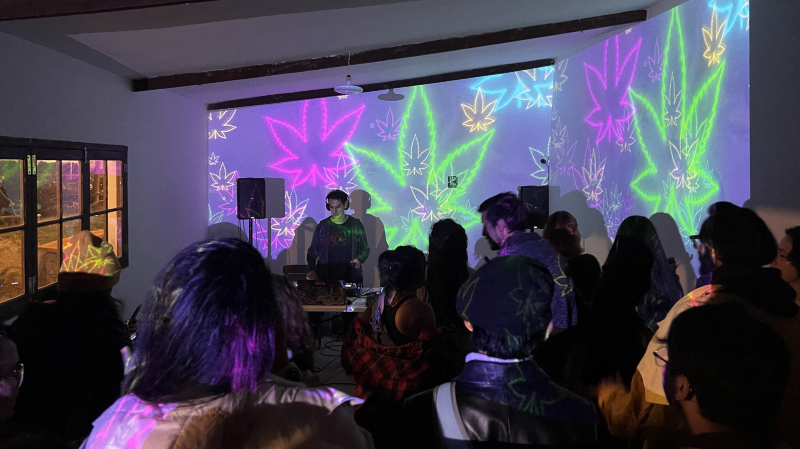

[Encuentro Nacional 4/20²⁶](./README.md) > Participar

# Participar

**Encuentro Nacional 4/20²⁶ Pro-Legalización 🌿**
*Celebración cultural replicable de ingreso y participación libre*

> 🌿 El 4/20²⁶ ya pasó. El proyecto sigue abierto. Participar ahora es sostener comunidad, fortalecer el manual y preparar el próximo 4/20.

> 🌿 Para gran parte del público, una de las mejores formas de ayudar en la estrategia pro-legalización es compartir todo lo referente al encuentro: links, posts, transmisiones, convocatorias y otras señales de que la conversación ya está viva — durante todo el año.

## Participación después del 4/20²⁶

El caso de referencia fue Proyecto Cultural Barranco, La Paz. El siguiente horizonte es 4/20²⁷.

Los dos puentes principales ahora son:

- **[Cómo (y por qué) organizar un 4/20 🌿](https://chat.whatsapp.com/DoFrA1mNgShCiOW2X84DSn)** — replicación, conversación y siguientes pasos.
- **[Aportes al Manual 4/20 🌿](https://chat.whatsapp.com/Fn2BXILT6Rj9TYdWgM7uF6)** — construcción del manual hacia una versión más completa e imprimible.

Si estuviste en el 4/20²⁶ del Barranco, tu experiencia ayuda a mejorar futuros eventos y el manual:
[Formulario de feedback 4/20²⁶ 🌿](https://forms.gle/jZyGex6kvsUFYXz18)

## Cómo se puede participar

El proyecto está abierto a muchas formas de participación. No todas requieren el mismo nivel de exposición, tiempo o compromiso.

La replicación es parte de la estrategia: cada espacio, artista, emprendimiento, transmisión o aporte que se suma ayuda a visibilizar la comunidad, desestigmatizar el cannabis y convertir la legalización en una conversación cada vez más presente en la vida pública boliviana.

Algunas formas posibles:

- Aportar al [Manual 4/20 🌿](https://manual420.barranco.life).
- Conversación sobre cómo organizar un 4/20 en tu territorio o espacio.
- Sostener comunidad y difusión durante el año.
- Celebrar el 4/20 a tu manera: una casa, un patio, un círculo privado, un espacio cultural.
- Aportar al [pliego petitorio](./PETITION.md) como argumento público.
- Compartir links, posts, transmisiones y convocatorias.
- Ayudar a tender puentes con artistas, espacios, prensa, colectivos o personas interesadas.
- Unirte a [Voluntariado Barranco](https://voluntariado.barranco.life/) si el espíritu del Barranco resonó.

## Formularios de referencia

Los formularios de convocatoria 2026 se preservan aquí como archivo y referencia para futuras ediciones — no como llamadas activas para un evento ya pasado.

- [Espacios Anfitriones](https://forms.gle/9KaoCBb7iaB3PV6x8) · [Documento](./SPACES.md)
- [Pliego Petitorio](https://forms.gle/96XH81TFQrCX1R7U6) · [Documento](./PETITION.md)
- [Artistas y Música](https://forms.gle/jfiZqSWUhqTDG45C8) · [Documento](./ARTISTS.md)
- [Artistas Visuales / Expo](https://forms.gle/FRbBrQBWWF9WhNSh6) · [Documento](./EXHIBITION.md)
- [Panelistas y conversación pública](https://forms.gle/Ufv8JDgU3FvjaAru9) · [Documento](./COLLOQUIUM.md)
- [Emprendimientos](https://forms.gle/3rUdi5U3ALktPdE86) · [Documento](./VENTURES.md)

## Otras formas de sumarse

El proyecto también está abierto a formas de participación que no entran en un formulario clásico:

- Celebrar el 4/20 a su manera y notificarnos o taggearnos para compartirlo.
- Recomendar una sede posible.
- Ayudar a tender puentes con prensa, artistas, colectivos o espacios aliados.
- Compartir gráficas, estados, historias, links, posts o transmisiones del encuentro.
- Difundir eventos propios del 4/20 que ayuden a volver más visible la comunidad, la fecha y el debate.
- Proponer ideas, materiales o aprendizajes que fortalezcan el [Manual 4/20 🌿](https://manual420.barranco.life).

## Qué pasa después de participar

Tres direcciones naturales para quien se suma:

1. Conversación sobre cómo y por qué organizar un 4/20 en su territorio → [grupo de replicación](https://chat.whatsapp.com/DoFrA1mNgShCiOW2X84DSn).
2. Aportes al manual → [grupo manual](https://chat.whatsapp.com/Fn2BXILT6Rj9TYdWgM7uF6).
3. Sostener comunidad, territorio y preparar futuras réplicas → chat general y grupos departamentales.

## WhatsApp

Si algo no encaja todavía en una forma específica, WhatsApp puede ayudar a ubicarlo mejor:

- [Chat general 4/20²⁶ 🌿](https://chat.whatsapp.com/LGRvbEMEBZ8HruAqFBUoSE)
- [Cómo (y por qué) organizar un 4/20 🌿](https://chat.whatsapp.com/DoFrA1mNgShCiOW2X84DSn)
- [Aportes al Manual 4/20 🌿](https://chat.whatsapp.com/Fn2BXILT6Rj9TYdWgM7uF6)
- [La Paz 4/20²⁶](https://chat.whatsapp.com/JCVnlJgnL78G7S3ejXSL52)
- [Cochabamba 4/20²⁶](https://chat.whatsapp.com/Be6udeZmtBV6lGgMSsXAWz)
- [Potosí 4/20²⁶](https://chat.whatsapp.com/HMNS1eCZ9bY36FcpFbT5Kp)
- [Santa Cruz 4/20²⁶](https://chat.whatsapp.com/I9z6mOAEsfJ5wFHwNvvEer)
- [Tarija 4/20²⁶](https://chat.whatsapp.com/DOEQk4gdyr10MIAmKNyQxa)
- [Chuquisaca 4/20²⁶](https://chat.whatsapp.com/Jjkf5BeKZ99C482SEh6Gaj)
- [Oruro 4/20²⁶](https://chat.whatsapp.com/L96GjiiFHhiL8TT36wcG5b)
- [Orientación Medicinal 🌿](https://chat.whatsapp.com/IBKq1Bw3MjxKfaMYyjTGg8)
- [Orientación Legal 🌿](https://chat.whatsapp.com/JQYgV6zeIbzC6T0ryAnJPs)

## Relación con otros documentos

- [Página principal del encuentro](./README.md)
- [Cómo contribuir](./CONTRIBUTE.md)
- [Espacios anfitriones](./SPACES.md)
- [Artistas y Música](./ARTISTS.md)
- [Artistas Visuales / Expo](./EXHIBITION.md)
- [Colloquium](./COLLOQUIUM.md)
- [Emprendimientos](./VENTURES.md)
- [Participación Virtual](./VIRTUAL.md)
- [Pliego petitorio](./PETITION.md)
- [Historia y aprendizajes](./HISTORY.md)
- [Comunidad](./COMMUNITY.md)
- [Manual 4/20 🌿](https://manual420.barranco.life)

Participar no es entrar todos del mismo modo. Es encontrar una forma realista, prudente y viva de ayudar a que el 4/20 brote en más lugares, con más comunidad y con más claridad estratégica.
