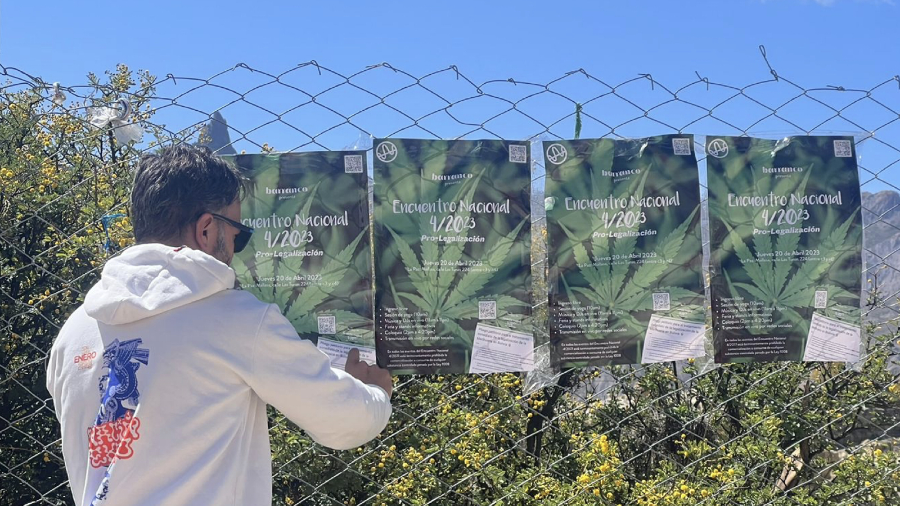

[4/20²⁶ 🌿](./README.md) > Pliego Petitorio

# Pliego Petitorio

**Encuentro Nacional 4/20²⁶ Pro-Legalización 🌿**  
*Celebración cultural replicable de ingreso y participación libre*

> 🌿 El pliego no está aquí para cerrar una conversación, sino para ayudar a abrirla mejor.

> 🌿 Si el encuentro muestra una posibilidad en la práctica, el pliego intenta darle una forma pública que pueda crecer, afinarse y servir más allá de una sola fecha.

## Qué es este pliego

Este pliego petitorio es una herramienta abierta para acompañar el Encuentro Nacional 4/20²⁶ 🌿 desde una dimensión ciudadana, cultural y pública.

No busca presentarse como una voz cerrada, perfecta o definitiva. Busca reunir una base común de preocupaciones, argumentos, aprendizajes y propuestas que pueda madurar con aportes de más personas a lo largo del tiempo.

Su función no es reemplazar la experiencia cultural del encuentro, sino complementarla: traducir parte de esa experiencia en una invitación más explícita a abrir una conversación seria, humana y mejor informada sobre la legalización del cannabis en Bolivia.

## Qué busca expresar

Este pliego busca expresar, de manera clara y abierta, que:

- Existe una parte de la ciudadanía que quiere una conversación más madura sobre el cannabis.
- El tratamiento del tema no debería quedar atrapado solo en prejuicios, castigo o silencio.
- Hay razones culturales, médicas, industriales, sociales y jurídicas para revisar el enfoque actual.
- La discusión pública puede darse con más seriedad, mejor información y menos miedo.
- La legalización no necesita imaginarse solo desde la confrontación, sino también desde la desestigmatización y la experiencia social compartida.

## Versión inicial del pliego

> ℹ️ Esta es una **versión inicial abierta** del pliego. No pretende ser una versión final ni cerrada. Se publica desde ahora para que pueda ser leída, discutida, firmada, criticada y enriquecida con aportes de la comunidad.

**A las autoridades del Estado Plurinacional de Bolivia, y a la sociedad boliviana en su conjunto:**

Quienes suscribimos este pliego solicitamos la apertura seria, informada y sin prejuicios de una conversación nacional sobre la legalización del cannabis en Bolivia.

Lo hacemos desde una convicción simple: el enfoque actual no está resolviendo el tema con madurez, y mantenerlo atrapado entre castigo, miedo, silencio y desinformación solo prolonga un problema que merece ser tratado con más honestidad, inteligencia y humanidad.

Pedimos que el cannabis deje de ser abordado únicamente desde una mirada punitiva o estigmatizante, y que se reconozca la necesidad de revisar el marco vigente a la luz de múltiples dimensiones que ya no pueden seguir siendo ignoradas:

- **Dimensión cultural:** Existe una cultura viva alrededor del cannabis que no se reduce a prejuicios ni a reducciones simplistas. Hay comunidad, arte, conversación, búsqueda de bienestar, autorregulación social y experiencias colectivas que merecen ser observadas con mayor seriedad.
- **Dimensión médica:** Cada vez hay más interés social y evidencia internacional en torno a usos terapéuticos y aplicaciones clínicas del cannabis y sus derivados. El debate boliviano no debería seguir dándole la espalda a esta realidad.
- **Dimensión industrial y económica:** El cannabis y el cáñamo tienen potencial productivo, industrial y económico en áreas que van mucho más allá del consumo recreativo. Mantener un enfoque rígido impide incluso discutir esas posibilidades con seriedad.
- **Dimensión social y jurídica:** La persecución, el estigma y la confusión legal no están ayudando a construir una sociedad más sana ni más libre. En muchos casos, solo profundizan miedo, arbitrariedad, extorsión, prejuicios y falta de información.
- **Dimensión humana:** El país necesita una conversación más adulta sobre libertad, límites, cuidado, salud pública, convivencia y responsabilidad individual. Seguir negando el tema no lo hace desaparecer; solo lo vuelve más torpe y más injusto.

Por todo ello, solicitamos:

1. **La apertura de una conversación pública seria, plural e informada** sobre la legalización del cannabis en Bolivia.
2. **La revisión del enfoque legal vigente**, incluyendo sus efectos sociales, culturales, médicos y económicos.
3. **La incorporación de conocimiento actualizado y referencias internacionales** para enriquecer el debate nacional con más contexto y menos miedo.
4. **El fin del tratamiento rígido, simplista o puramente estigmatizante** del tema en el discurso público.
5. **La posibilidad de avanzar, de manera gradual, responsable y bien informada,** hacia marcos más humanos, realistas y coherentes con la realidad contemporánea.

No planteamos este pedido desde la confrontación por la confrontación misma. Lo hacemos porque creemos que Bolivia puede madurar su conversación sobre este tema y abrirse a una mirada más libre, responsable y humana.

También creemos que una parte importante de ese cambio no vendrá solo de discursos o consignas, sino de experiencias culturales y sociales que ayuden a desestigmatizar, visibilizar y volver más comprensible esta realidad para la sociedad en general.

Este pliego no cierra la conversación. La abre.

## Qué no busca ser

Este pliego no pretende ser:

- Un texto cerrado a revisión.
- Una pieza escrita solo para personas ya convencidas.
- Un manifiesto maximalista desconectado de la realidad boliviana.
- Una instrucción para vulnerar la ley vigente.
- Una voz única que hable por toda la diversidad de la cultura 4/20.

Justamente por eso, la versión inicial del pliego se publica desde ahora dentro de este documento: para que no quede escondida detrás de una consigna abstracta y pueda comenzar a enriquecerse a la vista de todos.

## Relación con el encuentro

El Encuentro Nacional 4/20²⁶ 🌿 busca abrir celebraciones culturales replicables, de ingreso y participación libre, que ayuden a visibilizar esta cultura de una manera más madura, cuidada y hospitalaria.

El pliego acompaña esa estrategia desde otro lugar: intenta poner en palabras parte de lo que esas celebraciones muestran en la práctica.

En otras palabras, el encuentro crea experiencia social; el pliego intenta convertir parte de esa experiencia en una invitación pública a revisar prejuicios, abrir debate y madurar la conversación sobre la legalización. La apuesta es que, a medida que la comunidad 4/20, sus celebraciones y el propio debate se vuelvan más visibles en la vida pública, el tema se vuelva también más difícil de ignorar para autoridades, medios y actores políticos.

## Relación con el Manual 4/20

Este documento quiere dialogar cada vez mejor con el [Manual 4/20 🌿](https://manual420.barranco.life).

La idea es que el pliego no dependa solo de opiniones o slogans, sino que pueda fortalecerse con contexto, referencias, lenguaje más preciso y aprendizajes mejor documentados. A su vez, el manual puede ayudar a que este pliego se vuelva más útil, más claro y menos reactivo.

## Convocatoria abierta a contribuciones

El pliego está abierto a aportes. Nos interesa especialmente recibir contribuciones que ayuden a:

- Afinar el lenguaje.
- Mejorar el tono público.
- Corregir exageraciones o simplificaciones innecesarias.
- Incorporar mejores referencias médicas, jurídicas, culturales o históricas.
- Volver el texto más útil para dialogar también con escépticos y público general.
- Conectar mejor la dimensión ciudadana del pliego con el espíritu cultural del encuentro.

No buscamos solo “sumar firmas”. Buscamos que el propio texto mejore y que, con el tiempo, se vuelva más claro, más fuerte y más útil para conversar también fuera de la burbuja 4/20.

## Cómo aportar ahora

En esta etapa, la forma activa de aportar al pliego es a través del formulario de firmas y contribuciones:

**Formulario activo:** [Pliego Petitorio](https://forms.gle/96XH81TFQrCX1R7U6)

También puedes acercarte a la [comunidad 4/20²⁶ 🪴](https://chat.whatsapp.com/KvN6wsDnoLR1ytdLJI3m00).

## Qué tipo de mejoras buscamos

Nos interesan especialmente aportes que ayuden a mover el pliego en estas direcciones:

### Más claridad
Que el texto diga mejor lo que quiere decir, con menos ruido y menos grandilocuencia.

### Más madurez pública
Que sea más difícil descartarlo como una simple consigna de nicho o una reacción impulsiva.

### Más apertura
Que también pueda ser leído por personas no consumidoras, escépticas o simplemente curiosas.

### Más realidad boliviana
Que el texto no parezca importado sin filtro, sino pensado desde el contexto cultural, social y legal de Bolivia.

### Más diálogo con aprendizajes reales
Que el pliego se nutra de lo que ya han mostrado años de encuentro, espacios anfitriones, comunidad, protocolo y documentación.

## Estado actual

En esta etapa, el pliego debe entenderse como un documento en desarrollo. El texto incluido más arriba es una versión inicial pública, abierta a enriquecerse con el tiempo.

Su valor no está en aparentar cierre, sino en abrir una base común que pueda volverse más sólida, más justa y más útil con el tiempo.

## Relación con otros documentos

Este archivo dialoga especialmente con:

- [Página principal del encuentro](./README.md)
- [Espacios anfitriones](./SPACES.md)
- [Mapa de participación y convocatorias](./PARTICIPATE.md)
- [Historia y aprendizajes](./HISTORY.md)
- [Comunidad](./COMMUNITY.md)
- [Manual 4/20 🌿](https://manual420.barranco.life)
