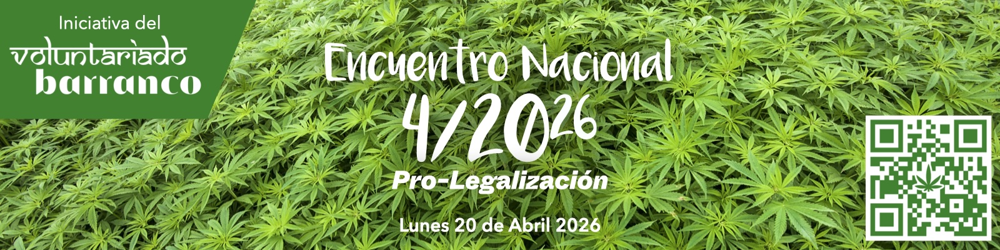

# Encuentro Nacional 4/20²⁶ Pro-Legalización 🌿
*Celebración cultural replicable de ingreso y participación libre*

Celebraciones culturales abiertas, cuidadas y replicables para desestigmatizar, visibilizar y madurar la conversación sobre la legalización del cannabis en Bolivia.

> 🌿 La comunidad real de este proyecto vive primero en [4/20²⁶ 🪴](https://chat.whatsapp.com/KvN6wsDnoLR1ytdLJI3m00). Este repositorio existe para documentar, clarificar y fortalecer lo que la comunidad va construyendo, no para reemplazarla.
>
> 🌿 En esta fase ya están disponibles las principales convocatorias del encuentro junto con sus documentos de contexto: [Espacios anfitriones](./SPACES.md), [Pliego petitorio](./PETITION.md), [Artistas y Música](./ARTISTS.md), [Artistas Visuales / Expo](./EXHIBITION.md), [Colloquium](./COLLOQUIUM.md), [Emprendimientos](./VENTURES.md) y [Participación Virtual](./VIRTUAL.md).

## Novedades
> 🌿 Ya están disponibles los formularios principales del encuentro y sus documentos de contexto.
>
> - [Espacios Anfitriones](https://forms.gle/9KaoCBb7iaB3PV6x8) · [Documento](./SPACES.md)
> - [Pliego Petitorio](https://forms.gle/96XH81TFQrCX1R7U6) · [Documento](./PETITION.md)
> - [Artistas y Música](https://forms.gle/jfiZqSWUhqTDG45C8) · [Documento](./ARTISTS.md)
> - [Artistas Visuales / Expo](https://forms.gle/FRbBrQBWWF9WhNSh6) · [Documento](./EXHIBITION.md)
> - [Panelistas y conversación pública](https://forms.gle/Ufv8JDgU3FvjaAru9) · [Documento](./COLLOQUIUM.md)
> - [Emprendimientos](https://forms.gle/3rUdi5U3ALktPdE86) · [Documento](./VENTURES.md)
>
> La capa [virtual](./VIRTUAL.md) también ya está activa, aunque no tenga formulario propio: artistas, espacios y panelistas pueden indicar en sus propios formularios si su participación será también virtual o remota.

## Qué es

**Encuentro Nacional 4/20²⁶ Pro-Legalización 🌿** es una infraestructura abierta para celebraciones culturales 4/20 de **ingreso y participación libre**.

Nace en Bolivia, con **Proyecto Cultural Barranco** como caso de referencia documentado, pero está abierto a replicarse, traducirse y adaptarse en otros territorios, idiomas y marcos legales si existe interés real y suficiente cuidado para sostenerlo.

No busca solo anunciar una fecha. Busca reunir una forma más clara, hospitalaria y replicable de organizar celebraciones 4/20: con cultura, cuidado del espacio, prudencia legal, comunidad, aprendizaje y documentación abierta.

## Idea madre

El 4/20 muestra que sí es posible una comunidad espontánea, diversa, colaborativa y cuidadosa del espacio. **Voluntariado Barranco** busca cultivar durante todo el año esa misma posibilidad: una forma más libre, responsable y humana de convivir, organizarse y crear en común.

Creemos que celebraciones culturales abiertas, cuidadas y cada vez más visibles pueden ayudar a desestigmatizar esta cultura ante la sociedad, sumar a escépticos y público general, e ir acercando el país a una conversación más madura sobre la legalización. No apostamos a una lógica de choque permanente entre convencidos y autoridades, sino a una visibilización cultural sostenida a través del ejemplo, la hospitalidad, la cultura y la experiencia compartida.

La apuesta es que, mientras la comunidad 4/20, sus celebraciones, sus expresiones culturales y el propio debate se vuelvan cada vez más visibles en la vida pública —desde eventos alineados con esta propuesta o incluso desde otros que no lo estén del todo— más difícil será seguir tratándolo como algo marginal o ajeno al interés general.

## Qué lo hace distinto

- **Ingreso y participación libre:** Sin convertir la celebración en un filtro económico de entrada.
- **Espacios anfitriones:** El encuentro no depende de una sola sede ni de una única escala.
- **Prudencia legal:** Claridad sobre la Ley 1008, límites explícitos y cuidado del espacio.
- **Apertura real:** No está pensado solo para consumidores o personas ya convencidas, sino también para escépticos, curiosos y público general.
- **Participación voluntaria:** Artistas, espacios, panelistas, apoyos y colaboradores se suman desde convicción, no desde obligación.
- **Documentación viva:** El repositorio busca dejar aprendizajes, estructura y materiales útiles para adaptar, mejorar y replicar.

## Proyecto Cultural Barranco como caso de referencia

**Proyecto Cultural Barranco** es el caso de referencia documentado del que nacen muchos de los aprendizajes de este proyecto.

Las celebraciones 4/20 realizadas allí mostraron que sí es posible abrir un espacio cultural, libre y cuidado, donde conviven música, feria, conversación, arte, comunidad y una fuerte autorregulación social. Esa experiencia no se presenta como modelo único ni obligatorio, pero sí como un punto de partida real desde el cual otras sedes pueden imaginar su propia forma de participar según sus condiciones, su escala y su nivel de exposición. Quien quiera entender mejor cómo se traduce eso en capas concretas puede mirar [Espacios anfitriones](./SPACES.md), [Artistas y Música](./ARTISTS.md), [Artistas Visuales / Expo](./EXHIBITION.md), [Colloquium](./COLLOQUIUM.md), [Emprendimientos](./VENTURES.md) y [Participación Virtual](./VIRTUAL.md).

## Cómo participar

El proyecto está abierto a muchas formas de participación, entre ellas:

- **Espacios anfitriones**
- **Puntos de apoyo o difusión** de riesgo mínimo
- **Artistas, músicos, bandas y DJs**
- **Artistas visuales / expo / galería**
- **Panelistas y conversaciones públicas**
- **Emprendimientos**
- **Participación virtual, lives y transmisiones**
- **Aportes al pliego petitorio**
- **Otras categorías** que hagan sentido para el encuentro, aunque no hayan sido previstas de antemano

No todos los espacios o participantes tienen que sumarse de la misma manera. Parte de la lógica del encuentro es justamente permitir distintos niveles de visibilidad, compromiso y riesgo.

## Modalidades de participación

### Espacio anfitrión público
Sede visible que convoca, aloja actividades y se suma de forma abierta al encuentro.

### Locación secreta
Participa con una estrategia de comunicación más cuidada, revelando la locación al público recién la noche anterior o con muy poca anticipación cuando haga sentido.

### Punto de apoyo o difusión
No organiza necesariamente una celebración completa, pero ayuda a visibilizar el encuentro con una recomendación, un QR, una historia, una mención, una cartelera o una invitación.

### Evento o celebración virtual
Live, streaming, transmisión, set, cobertura o encuentro remoto que se suma a la red del 20 de abril sin requerir una sede física presencial.

## Convocatorias activas ahora

En esta fase el encuentro ya está abierto a múltiples formas principales de participación: espacios, pliego, artistas y música, artistas visuales / expo, panelistas, emprendimientos y capa virtual.

Los formularios activos hoy son:

- [Espacios Anfitriones](https://forms.gle/9KaoCBb7iaB3PV6x8)
- [Pliego Petitorio](https://forms.gle/96XH81TFQrCX1R7U6)
- [Artistas y Música](https://forms.gle/jfiZqSWUhqTDG45C8)
- [Artistas Visuales / Expo](https://forms.gle/FRbBrQBWWF9WhNSh6)
- [Panelistas y conversación pública](https://forms.gle/Ufv8JDgU3FvjaAru9)
- [Emprendimientos](https://forms.gle/3rUdi5U3ALktPdE86)

La capa [virtual](./VIRTUAL.md) también ya está activa: artistas, espacios y panelistas pueden indicar en sus propios formularios si su participación será también virtual o remota.

## Participación justa, costos y transparencia

El encuentro quiere tratar la participación de manera más justa y transparente que muchas convocatorias culturales.

Si el evento genera ingresos —especialmente por barra u otra actividad pública— la intención es cubrir primero las necesidades operativas reales del evento, incluyendo transporte especial o logística excepcional para artistas u otros participantes clave cuando haga falta, antes de considerar cualquier excedente para la caja de **Voluntariado Barranco**.

La idea no es que alguien tenga que salir perdiendo por participar en una celebración que sí moviliza personas, trabajo, equipo y consumo. La rendición de cuentas buscará ser clara, pública y comprensible.

## Coloquio, conversación pública y manual

Si hay coloquio en esta edición, no buscamos repetir una conversación cerrada entre personas ya convencidas sobre por qué “debería” legalizarse el cannabis.

Nos interesa más abrir conversaciones útiles para el momento actual: cómo organizar celebraciones culturalmente defendibles, cómo convivir con libertad y límites claros, cómo desestigmatizar ante escépticos y público general, y qué aprendizajes pueden alimentar el [Manual 4/20 🌿](https://manual420.barranco.life).

## Documentos clave

- [Espacios anfitriones](./SPACES.md) — modalidades de participación, tipos de sedes, plan de contingencia y protocolo de seguridad.
- [Participar](./PARTICIPATE.md) — mapa de convocatorias activas y formas de sumarse.
- [Pliego petitorio](./PETITION.md) — versión inicial abierta del pliego y forma de aportar.
- [Artistas y Música](./ARTISTS.md) — convocatoria, enfoque artístico y caso particular del Barranco.
- [Artistas Visuales / Expo](./EXHIBITION.md) — muestra, galería, expo y apertura a público general.
- [Colloquium](./COLLOQUIUM.md) — conversación pública, panelistas y aprendizajes de organización.
- [Emprendimientos](./VENTURES.md) — feria, circulación, hospitalidad y sostenibilidad del espacio.
- [Participación Virtual](./VIRTUAL.md) — participación remota, transmisiones y asistencia a distancia.
- [Historia y aprendizajes](./HISTORY.md) — memoria del proceso 2022–2025 y giro conceptual hacia 2026.
- [Comunidad](./COMMUNITY.md) — capas de participación, visibilización y relación con Voluntariado Barranco.

## Compartir también es participar

Para gran parte del público, una de las mejores formas de ayudar en la estrategia pro-legalización es compartir todo lo referente al encuentro: links, posts, transmisiones, convocatorias y otras señales de que la conversación ya está viva.

La idea es que el tema se vuelva cada vez más visible en la vida pública, no solo a través de quienes organizan o participan directamente, sino también a través de quienes ayudan a mover la red.

La cobertura y transmisión del encuentro se irá organizando por [Instagram](http://instagram.com/barranco.life), [Twitch](http://twitch.tv/barranco_life), [Facebook](https://facebook.com/barranco.life) y/o [TikTok](https://www.tiktok.com/@barranco.life), según cómo se vayan confirmando las capas del día.

## Enlaces clave

- [4/20²⁶ 🪴 en WhatsApp](https://chat.whatsapp.com/KvN6wsDnoLR1ytdLJI3m00)
- [Proyecto Cultural Barranco](https://barranco.life)
- [Voluntariado Barranco](https://voluntariado.barranco.life/)
- [Manual 4/20 🌿](https://manual420.barranco.life)
- [Instagram del Barranco](http://instagram.com/barranco.life)
- [Twitch del Barranco](http://twitch.tv/barranco_life)
- [Facebook del Barranco](https://facebook.com/barranco.life)
- [TikTok del Barranco](https://www.tiktok.com/@barranco.life)

## Estado

Este repositorio está siendo reestructurado para la edición 2026.

La intención es documentar no solo una fecha, sino una forma viva, abierta y replicable de organizar celebraciones culturales 4/20 con cuidado, libertad, límites claros, participación más justa y rendición transparente. En esta etapa, la prioridad ya no es solo abrir espacios anfitriones, sino articular mejor todas las capas principales del encuentro y volverlas más discoverable para comunidad, aliados y público general.
