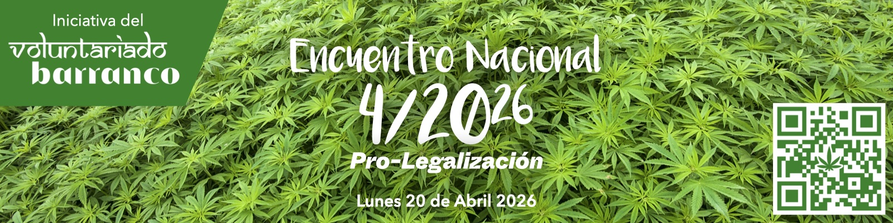

# Encuentro Nacional 4/20²⁶ Pro-Legalización 🌿
*Celebración cultural replicable de ingreso y participación libre*

Celebraciones culturales abiertas, cuidadas y replicables para desestigmatizar, visibilizar y madurar la conversación sobre la legalización del cannabis en Bolivia.

> 🌿 La comunidad de este proyecto vive primero en WhatsApp — y no para en abril. Este repositorio existe para documentar, clarificar y fortalecer lo que la comunidad va construyendo, no para reemplazarla.

## Novedades

> 🌿 El 4/20²⁶ ya ocurrió. Tres días en Proyecto Cultural Barranco como caso de referencia del primer Encuentro Nacional. La fase que sigue tiene dos pilares: **fortalecer el Manual 4/20 🌿** y **organizar el próximo 4/20**.
>
> Si estuviste en el 4/20²⁶ del Barranco, tu experiencia ayuda a mejorar futuros eventos:
> [Formulario de feedback 4/20²⁶ 🌿](https://forms.gle/jZyGex6kvsUFYXz18)
>
> Puentes post-evento:
> - [Cómo (y por qué) organizar un 4/20 🌿](https://chat.whatsapp.com/DoFrA1mNgShCiOW2X84DSn) — replicación, conversación y siguientes pasos
> - [Aportes al Manual 4/20 🌿](https://chat.whatsapp.com/Fn2BXILT6Rj9TYdWgM7uF6) — construcción del manual
>
> La comunidad no espera hasta abril. Compartí información, eventos, materiales, reflexiones y señales de la movida durante todo el año.

## Qué es

**Encuentro Nacional 4/20²⁶ Pro-Legalización 🌿** es una infraestructura abierta para celebraciones culturales 4/20 de **ingreso y participación libre**.

Nace en Bolivia, con **Proyecto Cultural Barranco** como caso de referencia documentado, pero está abierto a replicarse, traducirse y adaptarse en otros territorios, idiomas y marcos legales si existe interés real y suficiente cuidado para sostenerlo.

No buscaba solo anunciar una fecha. Busca reunir una forma más clara, hospitalaria y replicable de organizar celebraciones 4/20: con cultura, cuidado del espacio, prudencia legal, comunidad, aprendizaje y documentación abierta.

## Idea madre

El 4/20 muestra que sí es posible una comunidad espontánea, diversa, colaborativa y cuidadosa del espacio. **Voluntariado Barranco** busca cultivar durante todo el año esa misma posibilidad: una forma más libre, responsable y humana de convivir, organizarse y crear en común.

El 4/20²⁶ en el Barranco lo confirmó: el cannabis no fue el centro social más profundo. El centro más hondo fue la manera alternativa de organizarnos — co-crear, adaptarnos, cuidar el espacio, colaborar, participar y estar juntos entre personas diversas.

Creemos que celebraciones culturales abiertas, cuidadas y cada vez más visibles pueden ayudar a desestigmatizar esta cultura, sumar a escépticos y público general, e ir acercando al país a una conversación más madura sobre la legalización. Replicar eventos 4/20 en distintas ciudades no es un detalle logístico: es parte de la estrategia del movimiento.

## Proyecto Cultural Barranco como caso de referencia

**Proyecto Cultural Barranco** es el caso de referencia documentado del que nacen los aprendizajes de este proyecto.

El 4/20²⁶ se vivió allí como tres días de celebración co-creada: preparativos abiertos el sábado 18 y domingo 19, día central el lunes 20. No hubo incidentes. La lógica de "voluntarios por un día" funcionó en la práctica — sin la ayuda espontánea de quienes estuvieron, no habría sido posible sostener tres días. Música, expo, emprendimientos, coloquio, yoga y encuentro comunitario convivieron con naturalidad.

Esa experiencia no se presenta como modelo único ni obligatorio, pero sí como un punto de partida real desde el cual otros espacios pueden imaginar su propia forma de participar.

## Los dos pilares hacia 4/20²⁷

### Fortalecer el Manual 4/20 🌿

El [Manual 4/20 🌿](https://manual420.barranco.life) es el recurso vivo de contexto, prudencia y aprendizaje abierto. La meta es hacerlo más completo, más útil, más legible socialmente y eventualmente imprimirlo para que circule más allá de los canales digitales.

La información es poder: reduce improvisación, vulnerabilidad ante extorsión y desinformación, y prepara a la gente para conversaciones públicas más maduras.

Para aportar: [Aportes al Manual 4/20 🌿](https://chat.whatsapp.com/Fn2BXILT6Rj9TYdWgM7uF6)

### Organizar o replicar un 4/20

El otro pilar es la replicación. Un 4/20 puede empezar pequeño: una casa, un patio, un espacio cultural, un círculo privado. Cada espacio que se abre ayuda a visibilizar la comunidad y convertir la legalización en una conversación cada vez más presente en la vida pública boliviana.

Para conversar sobre cómo y por qué organizar un 4/20: [Cómo (y por qué) organizar un 4/20 🌿](https://chat.whatsapp.com/DoFrA1mNgShCiOW2X84DSn)

## Qué lo hace distinto

- **Ingreso y participación libre:** Sin convertir la celebración en un filtro económico de entrada.
- **Espacios anfitriones:** El encuentro no depende de una sola sede ni de una única escala.
- **Prudencia legal:** Claridad sobre la Ley 1008, límites explícitos y cuidado del espacio.
- **Apertura real:** No pensado solo para consumidores o personas ya convencidas, sino también para escépticos, curiosos y público general.
- **Participación voluntaria:** Artistas, espacios, panelistas y colaboradores se suman desde convicción, no desde obligación.
- **Documentación viva:** El repositorio busca dejar aprendizajes, estructura y materiales útiles para adaptar, mejorar y replicar.

## Cómo participar después del 4/20²⁶

El proyecto sigue abierto. La replicación es parte de la estrategia.

Algunos caminos posibles ahora:

- Aportar al [Manual 4/20 🌿](https://manual420.barranco.life)
- Conversación sobre cómo organizar un 4/20 en tu territorio
- Sostener comunidad y difusión durante el año
- Celebraciones íntimas o privadas
- Espacios culturales, universidades, círculos de estudio
- Contribuir al [pliego petitorio](./PETITION.md) como argumento público
- Unirte a [Voluntariado Barranco](https://voluntariado.barranco.life/) si el espíritu del Barranco resonó

Ver también: [Cómo contribuir](./CONTRIBUTE.md) y [Participar](./PARTICIPATE.md)

## Documentos clave

- [Cómo contribuir](./CONTRIBUTE.md) — mapa post-evento de contribución y participación.
- [Participar](./PARTICIPATE.md) — caminos de participación.
- [Espacios anfitriones](./SPACES.md) — guía de referencia para espacios futuros.
- [Pliego petitorio](./PETITION.md) — argumento público y articulación cívica.
- [Artistas y Música](./ARTISTS.md) — capa musical: referencia y playbook.
- [Artistas Visuales / Expo](./EXHIBITION.md) — expo como puente hacia público general.
- [Colloquium](./COLLOQUIUM.md) — conversación pública y puente hacia replicación.
- [Emprendimientos](./VENTURES.md) — feria, circulación y hospitalidad.
- [Participación Virtual](./VIRTUAL.md) — difusión y replicación virtual.
- [Historia y aprendizajes](./HISTORY.md) — memoria del proceso 2022–2026.
- [Comunidad](./COMMUNITY.md) — capas de participación y arquitectura WhatsApp.
- [Manual 4/20 🌿](https://manual420.barranco.life) — marco vivo de contexto y aprendizaje.
- [Voluntariado Barranco](https://voluntariado.barranco.life/) — inspiración comunitaria más allá del 20 de abril.

## Compartir también es participar

Para gran parte del público, una de las mejores formas de ayudar en la estrategia pro-legalización es compartir todo lo referente al encuentro: links, posts, transmisiones, materiales y otras señales de que la conversación ya está viva — durante todo el año, no solo en abril.

## Enlaces clave

- [Chat 4/20²⁶ 🌿](https://chat.whatsapp.com/LGRvbEMEBZ8HruAqFBUoSE) — chat general abierto
- [Cómo (y por qué) organizar un 4/20 🌿](https://chat.whatsapp.com/DoFrA1mNgShCiOW2X84DSn)
- [Aportes al Manual 4/20 🌿](https://chat.whatsapp.com/Fn2BXILT6Rj9TYdWgM7uF6)
- [Orientación Medicinal 🌿](https://chat.whatsapp.com/IBKq1Bw3MjxKfaMYyjTGg8)
- [Orientación Legal 🌿](https://chat.whatsapp.com/JQYgV6zeIbzC6T0ryAnJPs)
- [Manual 4/20 🌿](https://manual420.barranco.life)
- [Voluntariado Barranco](https://voluntariado.barranco.life/)
- [Proyecto Cultural Barranco](https://barranco.life)
- [Formulario de feedback 4/20²⁶](https://forms.gle/jZyGex6kvsUFYXz18)
- [Instagram del Barranco](http://instagram.com/barranco.life)
- [Twitch del Barranco](http://twitch.tv/barranco_life)
- [Facebook del Barranco](https://facebook.com/barranco.life)
- [TikTok del Barranco](https://www.tiktok.com/@barranco.life)

## Estado

El 4/20²⁶ ocurrió. El repositorio está siendo reestructurado como hub post-evento: documentación del caso de referencia 2026, fortalecimiento del Manual 4/20 🌿 y guía abierta de replicación hacia 4/20²⁷.

> *Este encuentro tiene un enfoque cultural, organizativo y preventivo. No promueve la vulneración de la Ley 1008 ni ofrece instrucciones para delinquir. La responsabilidad legal es individual.*
