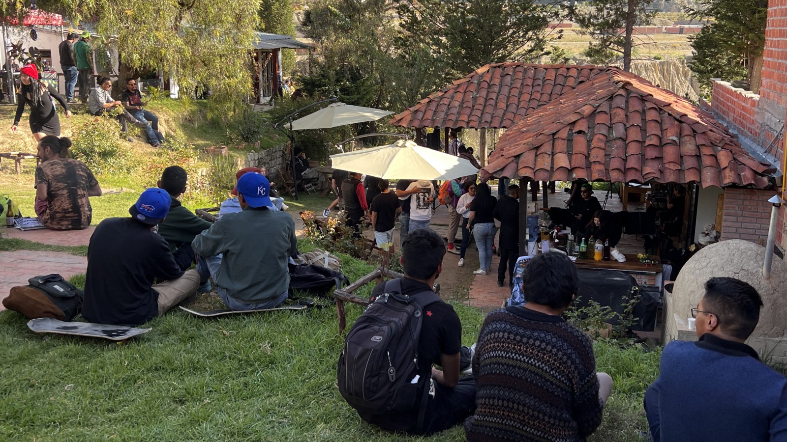

[4/20²⁶ 🌿](./README.md) > Espacios Anfitriones

# Espacios Anfitriones

**Encuentro Nacional 4/20²⁶ Pro-Legalización 🌿**  
*Celebración cultural replicable de ingreso y participación libre*

> ⚠️ Este documento tiene un enfoque cultural, organizativo y preventivo. No promueve la vulneración de la ley ni ofrece instrucciones para delinquir. En Bolivia rige la **Ley 1008**, por lo que cada espacio y cada persona debe actuar con pleno conocimiento del marco legal vigente, sus propios límites y su responsabilidad individual.

> *Día central 2026:* *lunes 20 de abril de 2026*.
>
> *Actividades opcionales:* viernes 17 al domingo 19, según cada espacio.
>
> *Nota electoral:* en [Oruro](https://chat.whatsapp.com/L96GjiiFHhiL8TT36wcG5b), Beni, [Chuquisaca](https://chat.whatsapp.com/Jjkf5BeKZ99C482SEh6Gaj), [Tarija](https://chat.whatsapp.com/DOEQk4gdyr10MIAmKNyQxa) y [Santa Cruz](https://chat.whatsapp.com/I9z6mOAEsfJ5wFHwNvvEer), la segunda vuelta del domingo 19 de abril condiciona fuertemente cualquier actividad pública ese fin de semana. El día de la votación no debe contarse como fecha útil para actividad pública, y por prudencia el foco allí debería ponerse especialmente en el lunes 20 o en formatos muy cuidados.

> ℹ️ Contenido sugerido para carteles visibles sobre la Ley 1008: 
> La comercialización o consumo de cannabis u otras sustancias controladas, en contravención a la Ley 1008, no es promovido ni permitido en este evento. La responsabilidad legal recae en cada persona por sus propios actos. El espacio se reserva el derecho de pedir el retiro de quien comprometa la seguridad o la continuidad de la actividad.

## Qué es un espacio anfitrión

Un **espacio anfitrión** es cualquier lugar, colectivo, plataforma o iniciativa que decide sumarse al Encuentro Nacional 4/20²⁶ 🌿 desde su propia realidad.

No todos los espacios tienen que participar del mismo modo ni con el mismo nivel de exposición. Parte de la lógica del encuentro es justamente permitir una red diversa de participación: desde una sede visible y activa hasta una locación secreta, un punto de apoyo o difusión, o una celebración virtual.

La intención no es imponer un formato único, sino abrir una estructura replicable, prudente y hospitalaria que otras personas puedan adaptar según su contexto, su ciudad, su comunidad y su marco legal. Replicar eventos 4/20 en distintas ciudades no es un detalle logístico: es parte de la estrategia del movimiento. Cada espacio que se abre ayuda a visibilizar la comunidad, desestigmatizar el cannabis y convertir la legalización en una conversación cada vez más presente en la vida pública boliviana.

Un espacio anfitrión no solo “cede lugar”. También puede volverse el punto donde brotan artistas, expo, conversación, feria, transmisión, comunidad nueva y aprendizajes que luego fortalecen la documentación del encuentro.

Dicho de otro modo: sumarse puede ser también una forma de descubrir, aunque sea por un día, lo que una comunidad bien orientada puede hacer posible cuando encuentra un lugar que la recibe con criterio y hospitalidad.

### Tipos de espacios que pueden sumarse

El encuentro puede dialogar con muchos tipos de espacios, siempre que exista coherencia con su espíritu general y con las realidades legales de cada caso.

Ejemplos posibles:

- **Proyecto cultural o centro cultural**
- **Casa o domicilio particular**
- **Casa de campo o quinta**
- **Terreno o espacio abierto privado**
- **Galería o taller artístico**
- **Cafetería, bar o local aliado**
- **Bosque, jardín o entorno natural** cuando exista cuidado real del lugar y claridad suficiente sobre su viabilidad
- **Sede pequeña de comunidad o colectivo**
- **Locación secreta**
- **Punto de apoyo o difusión**
- **Celebración virtual o transmisión online**

No todos estos formatos implican el mismo nivel de exposición, logística o riesgo. Precisamente por eso el encuentro se abre a distintas modalidades, en lugar de suponer que toda celebración 4/20 debe verse igual.

## Por qué sumarse

Sumarse como espacio anfitrión puede aportar a varias cosas al mismo tiempo:

- **Desestigmatización cultural:** Mostrar que esta cultura no se reduce a prejuicios, sino que puede expresarse con cuidado, arte, comunidad y límites claros.
- **Visibilización social:** Ayudar a que el tema exista en la conversación pública de una manera más madura y menos reactiva.
- **Puerta de entrada para escépticos y público general:** Ofrecer una experiencia humana, cultural y observacional también para quienes no consumen o no están convencidos.
- **Construcción de red:** Conectar espacios, artistas, comunidades, transmisiones, ideas y aprendizajes alrededor de una misma fecha.
- **Aporte a una estrategia de legalización no confrontacional:** Creemos que celebraciones abiertas, cuidadas y cada vez más visibles pueden acercar al país a una conversación más seria sobre la legalización, más por hospitalidad, ejemplo y experiencia compartida que por choque permanente.

[Volver al índice](#índice)

## Qué puede hacer posible un espacio que se suma

Una sede no necesita hacerlo todo para aportar. Incluso una participación pequeña puede ayudar a que el encuentro se vuelva más vivo, más claro y más visible.

Según su escala, identidad y condiciones, un espacio podría hacer posible, por ejemplo:

- [Artistas y música](./ARTISTS.md), desde sets pequeños hasta escenarios más completos.
- [Artistas visuales / expo](./EXHIBITION.md), incluyendo muestras que incluso duren más allá del 20 de abril.
- [Colloquium](./COLLOQUIUM.md), como puerta de entrada para público general, escépticos y conversación más madura.
- [Emprendimientos](./VENTURES.md), para volver el encuentro más habitable, hospitalario y sostenible.
- [Participación virtual](./VIRTUAL.md), tanto para sumarse como para asistir, mirar y compartir.

No todos los espacios tienen que abrir todas estas capas. Lo importante es encontrar una forma proporcionada, prudente y viva de sumarse. Cuando aparece un espacio, muchas veces la comunidad empieza a articularse bastante orgánicamente: se suman artistas, emprendimientos, apoyo para armar, difusión y gente que quiere aportar de una u otra manera.

## Modalidades de participación

### Espacio anfitrión público

Sede visible que convoca, aloja actividades y se suma de forma abierta al encuentro.

Puede incluir, según su capacidad:
- Música o sets.
- Feria o emprendimientos.
- Galería o expo.
- Conversaciones o coloquio.
- Proyecciones.
- Comida o barra.
- Espacios de descanso y convivencia.

Para imaginar mejor cómo podría verse cada una de esas capas, este documento dialoga también con [Artistas y Música](./ARTISTS.md), [Artistas Visuales / Expo](./EXHIBITION.md), [Colloquium](./COLLOQUIUM.md), [Emprendimientos](./VENTURES.md) y [Participación Virtual](./VIRTUAL.md).

Estos espacios publican en sus redes y canales de difusión siguiendo las pautas generales del encuentro, tanto por prudencia legal como por conveniencia organizativa: claridad sobre la Ley 1008, plan de contingencia, señalización visible, zona de deshecho de sustancias ilegales cuando corresponda, y una comunicación prudente que ayude a sostener la legitimidad cultural del evento. En departamentos donde exista segunda vuelta el domingo 19, esa fecha no debe contarse como día útil para actividad pública y conviene pensar con especial cuidado cualquier actividad del fin de semana previo.

### Locación secreta

Sede que participa con una estrategia de comunicación más cuidada. En Bolivia, esta modalidad puede ser especialmente útil cuando conviene reducir exposición pública previa.

La lógica general es que la locación se revele al público recién la noche anterior o con muy poca anticipación, normalmente a través del grupo departamental correspondiente, mientras que organizadores y voluntarios de apoyo pueden contar antes con la información necesaria para sostener la actividad.

Puede ser útil para:
- Pruebas piloto.
- Comunidades pequeñas.
- Espacios que prefieren ir paso a paso.
- Contextos donde conviene priorizar bajo perfil sin dejar de aportar.

### Punto de apoyo o difusión

No organiza necesariamente una celebración completa, pero ayuda a visibilizar el encuentro y a normalizar su presencia cultural.

Ejemplos:
- Celebrar el 4/20 a su manera y, si gusta, notificarnos o taggearnos para compartirlo.
- Compartir un QR, link, grupo departamental o formulario.
- Publicar en estados o redes.
- Compartir posts, transmisiones y convocatorias.
- Ayudar a mover todo lo referente al encuentro entre personas que podrían interesarse.
- Recomendar una sede.
- Invitar a artistas o aliados.
- Poner una pieza gráfica en cartelera o mostrador.
- Ayudar a tender puentes con prensa, colectivos o espacios amigos.
- Difundir también otros eventos 4/20 que, aunque no estén alineados del todo con esta propuesta, ayuden a volver más visible la comunidad, la fecha y el debate en la vida pública.

Esta modalidad es importante porque reduce la barrera de entrada: no todo el mundo tiene que organizar un evento para formar parte del movimiento. También permite que espacios, proyectos, empresas o comunidades puedan ser reconocidos como aliados o pro legalización sin asumir el mismo nivel de exposición que una sede anfitriona.

### Evento o celebración virtual

Live, streaming, transmisión, set, conversación, cobertura o encuentro remoto que se suma a la red del 20 de abril sin requerir una sede física presencial.

Esta modalidad permite:
- Sumar otras ciudades o países.
- Ampliar visibilidad con bajo costo.
- Abrir participación a personas que no pueden desplazarse.
- Conectar el encuentro con audiencias nuevas, especialmente en redes y plataformas de video.

Los links de estos eventos se difundirán como parte del movimiento. Cuando haga sentido, en [Proyecto Cultural Barranco](https://barranco.life) también podrán proyectarse o transmitirse como parte de la experiencia del encuentro, tal como se desarrolla en [Participación Virtual](./VIRTUAL.md#caso-particular-proyecto-cultural-barranco). También pueden ser especialmente valiosos en departamentos donde el contexto electoral haga más prudente reducir la apuesta presencial antes del lunes 20.

### Otras formas de participar

El encuentro también está abierto a formatos no previstos de antemano, siempre que sean coherentes con su espíritu general.

Ejemplos posibles:
- Proyección de documental o cine-foro.
- Muestra fotográfica.
- Lectura o performance.
- Actividad educativa.
- Microencuentro barrial.
- Intervención artística temporal.
- Colaboración entre sedes.

[Volver al índice](#índice)

## Principios mínimos para sumarse

Todo espacio anfitrión debería poder alinearse, al menos, con estos principios:

- **Cuidado del espacio:** La celebración no debería dejar el lugar peor de como estaba.
- **Prudencia legal:** Claridad sobre los límites del marco vigente y rechazo explícito a cualquier lectura de “todo vale”.
- **Hospitalidad:** Abrirse también a curiosos, escépticos y público general.
- **Participación libre:** Mantener el espíritu de acceso y colaboración voluntaria, incluso si existen dinámicas internas de sostenibilidad económica.
- **Límites claros:** Libertad no significa ausencia de reglas.
- **Responsabilidad individual:** El espacio no puede absorber ni borrar la responsabilidad de cada persona por sus actos.
- **Buen trato:** Evitar violencia, abuso, presión grupal o dinámicas torpes que perjudiquen al conjunto.

## Caso de referencia: Proyecto Cultural Barranco

**Proyecto Cultural Barranco** es el caso de referencia documentado del que nacen muchos de los aprendizajes que sostienen este proyecto.

Las celebraciones 4/20 realizadas allí mostraron que sí es posible abrir un espacio cultural, libre y cuidado, donde conviven música, feria, conversación, arte, comunidad y una fuerte autorregulación social. Esa experiencia no se presenta como modelo único ni obligatorio, pero sí como un punto de partida real desde el cual otras sedes pueden imaginar su propia forma de participar según su escala, sus condiciones y su nivel de exposición.

Quien quiera imaginar mejor cómo se traduce eso en capas concretas puede mirar también los casos particulares de [Artistas y Música](./ARTISTS.md#caso-particular-proyecto-cultural-barranco), [Artistas Visuales / Expo](./EXHIBITION.md#caso-particular-proyecto-cultural-barranco), [Colloquium](./COLLOQUIUM.md#caso-particular-proyecto-cultural-barranco), [Emprendimientos](./VENTURES.md#caso-particular-proyecto-cultural-barranco) y [Participación Virtual](./VIRTUAL.md#caso-particular-proyecto-cultural-barranco).

Además, al caer lunes este año, en Proyecto Cultural Barranco se contempla como ejemplo la posibilidad de actividades previas el sábado 18 y domingo 19 de abril: proyecciones, expo, presentaciones u otras formas de previa cultural que ayuden a expandir el encuentro más allá de una sola jornada. Esto no significa que la misma lógica deba copiarse sin más en todos los departamentos: en lugares con segunda vuelta el domingo 19, el foco debería ponerse especialmente en el lunes 20 o en formatos muy cuidados.

## Plan de contingencia y protocolo de seguridad

Este es uno de los aprendizajes más valiosos acumulados por el encuentro a lo largo de los años. No se presenta como receta rígida ni como garantía absoluta, pero sí como una base prudente para organizar celebraciones culturalmente defendibles en el contexto boliviano.

### Señalización visible y marco legal

Cada espacio debería contar con señalización clara y sobria que recuerde, al menos:

- La vigencia de la Ley 1008.
- Que el evento no promueve la vulneración de la ley.
- Que la responsabilidad legal recae en cada persona por sus propios actos.
- Que el espacio se reserva el derecho de pedir el retiro de quien comprometa la seguridad o la continuidad del encuentro.

El encuentro compartirá contenido base de carteles alusivos a la Ley 1008 para que cada espacio pueda imprimirlos y adaptarlos según su realidad. Esto forma parte del plan de contingencia general y también dialoga con el [Manual 4/20 🌿](https://manual420.barranco.life) como aprendizaje replicable.

### Control de ingreso y zonas sensibles

Cada sede debe pensar una lógica de ingreso coherente con su tipo de espacio, su tamaño y su nivel de exposición.

Orientaciones básicas:
- Cuidar especialmente accesos, salida y zonas visibles desde el exterior.
- Mantener una revisión razonable cuando el tipo de evento o espacio lo amerite.
- No permitir el ingreso con elementos que comprometan innecesariamente al espacio o al conjunto.
- Ser especialmente rigurosos en el perímetro inmediato cuando la visibilidad externa pueda generar problemas evitables.

### Zona de deshecho de sustancias ilegales

Cuando la sede lo considere adecuado, puede habilitar una zona o contenedor específico para el deshecho seguro de sustancias ilegales antes del ingreso o ante una situación detectada dentro del evento.

Idealmente, esta zona puede estar alejada del ingreso principal y, cuando haga sentido, en un área abierta que reduzca exposición innecesaria del resto del espacio.

La lógica no es normalizar ni promover nada, sino reducir riesgo para el espacio y para el conjunto en un contexto donde el marco legal sigue vigente.

### Actuación del staff o equipo anfitrión

Si dentro del evento se detecta una situación que compromete la prudencia legal o la seguridad general, el equipo del espacio puede:

- Pedir calma y colaboración.
- Solicitar a la persona que se retire.
- Invitarla a ir a la zona destinada para desechar la sustancia, si existe.
- Cortar la situación antes de que escale o exponga innecesariamente al conjunto.

La idea es intervenir temprano, con firmeza y sin espectáculo.

### En caso de control de autoridades

Si ocurre un control o inspección:

- Notificar de inmediato al responsable principal del espacio.
- Pedir calma al público.
- Comunicar la situación con serenidad, evitando pánico o reacciones torpes.
- Reafirmar que el espacio ha establecido medidas preventivas y que la responsabilidad individual no desaparece por estar dentro del evento.

### Orientaciones básicas de prudencia organizativa

Sin convertir esto en una receta rígida, hay algunas orientaciones que conviene considerar desde el inicio:

### Claridad del marco
- Dejar explícito que el encuentro no promueve la vulneración de la Ley 1008.
- Comunicar reglas básicas del espacio de forma visible y sobria.
- Evitar mensajes o dinámicas que puedan leerse como apología del delito.

### Ingreso y convivencia
- Tener una lógica de ingreso coherente con el tipo de espacio.
- Cuidar zonas de acceso, tránsito y salida.
- Priorizar calma, respeto y buen trato.
- Intervenir temprano ante desborde, agresividad o negligencia.

### Cuidado del entorno
- No sobrecargar el espacio por encima de lo que realmente puede sostener.
- Prever limpieza, residuos, baños, agua y descanso según corresponda.
- Considerar vecinos, ruido, horarios y entorno inmediato.

### Programación proporcional
- No toda sede necesita feria, coloquio, galería y tres escenarios al mismo tiempo.
- Una sede pequeña y bien cuidada puede ser tan valiosa como una más grande.
- Es mejor una propuesta simple y sostenible que una ambiciosa y mal contenida.

### Coloquio y participación remota

Si una sede incluye coloquio o conversación pública, no todo tiene que ocurrir de forma presencial. También pueden sumarse participantes virtuales junto con personas locales, como ya ocurrió en ediciones pasadas.

Eso puede ampliar voces, reducir costos y conectar mejor el encuentro con otras ciudades, países o trayectorias que no pueden estar físicamente presentes.

## Participación justa, costos y transparencia

Si una sede genera ingresos —por barra u otra actividad pública— la intención general es priorizar primero las necesidades operativas reales del evento.

Eso puede incluir, según el caso:
- Transporte especial.
- Logística excepcional.
- Apoyo técnico.
- Personal operativo indispensable.
- Cuidados mínimos para que artistas y participantes clave no tengan que salir perdiendo por sumarse.

Si después de cubrir lo necesario queda excedente, cada espacio puede decidir con transparencia cómo destinar una parte de esos fondos según su propia lógica. En casos como **Proyecto Cultural Barranco**, eso podría incluir un aporte a la caja de **Voluntariado Barranco**, pero no es una exigencia general para otras sedes.

La idea no es romantizar el voluntariado como si eso justificara precariedad. La idea es sostener una celebración libre y hospitalaria con mayor justicia, cuidado y transparencia.

[Volver al índice](#índice)

## Cómo proponer un espacio

En esta primera etapa, la convocatoria principal está enfocada en espacios anfitriones.

**Formulario activo:** [Espacios Anfitriones](https://forms.gle/9KaoCBb7iaB3PV6x8)

Si tienes dudas antes de llenar el formulario, también puedes moverte desde WhatsApp según tu territorio o interés:

- [Chat general 4/20²⁶ 🌿](https://chat.whatsapp.com/LGRvbEMEBZ8HruAqFBUoSE)
- [La Paz 4/20²⁶ 🟢](https://chat.whatsapp.com/JCVnlJgnL78G7S3ejXSL52)
- [Cochabamba 4/20²⁶ 🟢](https://chat.whatsapp.com/Be6udeZmtBV6lGgMSsXAWz)
- [Potosí 4/20²⁶ 🟡](https://chat.whatsapp.com/HMNS1eCZ9bY36FcpFbT5Kp)
- [Santa Cruz 4/20²⁶ ⚪️](https://chat.whatsapp.com/I9z6mOAEsfJ5wFHwNvvEer)
- [Tarija 4/20²⁶ ⚪️](https://chat.whatsapp.com/DOEQk4gdyr10MIAmKNyQxa)
- [Chuquisaca 4/20²⁶ ⚪️](https://chat.whatsapp.com/Jjkf5BeKZ99C482SEh6Gaj)
- [Oruro 4/20²⁶ ⚪️](https://chat.whatsapp.com/L96GjiiFHhiL8TT36wcG5b)

## Qué pasa después de proponer un espacio

En general, el proceso busca ser simple:

1. El espacio expresa interés y comparte su contexto.
2. Se conversa el tipo de participación más realista para esa sede y su calendario local.
3. Se define si encaja mejor como sede pública, locación secreta, punto de apoyo o celebración virtual.
4. Se ajustan expectativas, necesidades, prudencia legal y límites reales.
5. Si hay alineación suficiente, el espacio se integra a la red del encuentro y, cuando haga falta, a grupos operativos más específicos.

La meta no es sumar por sumar, sino sumar con claridad y base real.

## Relación con otros documentos

Este archivo dialoga especialmente con:

- [Página principal del encuentro](./README.md)
- [Participar](./PARTICIPATE.md)
- [Cómo contribuir](./CONTRIBUTE.md)
- [Artistas y Música](./ARTISTS.md)
- [Artistas Visuales / Expo](./EXHIBITION.md)
- [Colloquium](./COLLOQUIUM.md)
- [Emprendimientos](./VENTURES.md)
- [Participación Virtual](./VIRTUAL.md)
- [Pliego petitorio](./PETITION.md)
- [Historia y aprendizajes](./HISTORY.md)
- [Comunidad](./COMMUNITY.md)
- [Manual 4/20 🌿](https://manual420.barranco.life)

No todos los espacios tienen que participar de la misma manera. Lo importante es que cada uno pueda encontrar una forma honesta, prudente y viva de aportar, según su realidad local, su calendario y sus límites.

El objetivo no es imponer un molde. Es abrir una posibilidad replicable y dejar más clara la relación entre territorio, comunidad, prudencia y estrategia pro-legalización.
