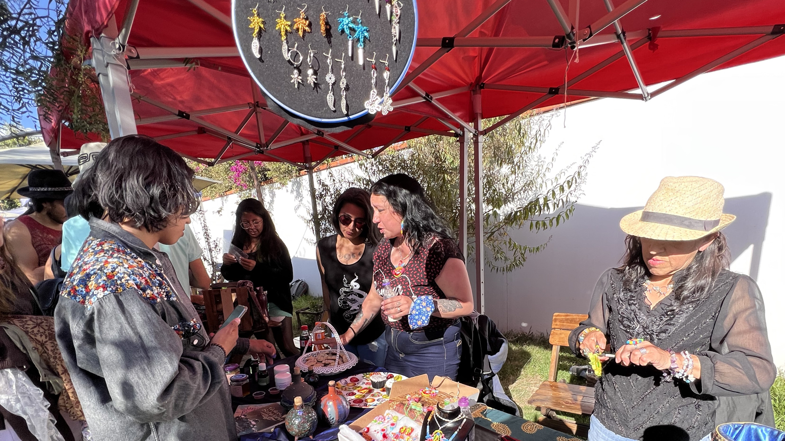

[4/20²⁶ 🌿](./README.md) > Emprendimientos

# Emprendimientos

**Encuentro Nacional 4/20²⁶ Pro-Legalización 🌿**  
*Celebración cultural replicable de ingreso y participación libre*

> 🌿 Los emprendimientos pueden ser una de las formas más concretas de volver el encuentro habitable, sostenible y hospitalario. No la única. Pero sí una de las más útiles para que una sede se sienta realmente viva.

> 🌿 También pueden ser una de las formas más claras de ayudar a que una celebración real se sostenga con mayor circulación, intercambio y vida de espacio.

> ℹ️ La convocatoria específica para [emprendimientos](https://forms.gle/3rUdi5U3ALktPdE86) ya está abierta. Este documento deja claro el espíritu general, para que emprendimientos y espacios puedan imaginar mejor las colaboraciones posibles.

## Qué lugar tienen los emprendimientos en el encuentro

Los emprendimientos no se piensan solo como “feria” o venta alrededor del evento.

También pueden ayudar a:

- Volver una sede más hospitalaria y autosostenible.
- Activar circulación de personas sin depender solo de música o coloquio.
- Abrir el encuentro a propuestas productivas, creativas o comunitarias.
- Hacer visible que esta cultura también tiene una dimensión económica, artesanal y cotidiana.
- Sostener una experiencia más completa para el público y para el propio espacio anfitrión.

En muchos casos, una capa de emprendimientos puede ser una de las formas más claras de que una celebración realmente se sienta viva.

## Cómo se entiende la participación de emprendimientos

La participación de emprendimientos, como la del público, la del espacio anfitrión y la de otras propuestas del encuentro, se piensa en principio como **gratuita y voluntaria**.

Eso ayuda a mantener el espíritu general del proyecto y reduce fricciones innecesarias.

Al mismo tiempo, eso no significa que un emprendimiento deba asumir por su cuenta costos desproporcionados por participar.

En principio, y como se maneja también en el caso de Proyecto Cultural Barranco, la participación se entiende sin cobro por estar dentro de la feria, apelando más bien a un aporte voluntario sobre las ganancias para el espacio cuando eso haga sentido.

Si una propuesta necesita traslado, mobiliario, energía, refrigeración, apoyo de montaje o alguna otra logística que excede lo razonable, la idea es que eso pueda hablarse con claridad. Cuando haga sentido, se buscará junto a la [comunidad](https://chat.whatsapp.com/KvN6wsDnoLR1ytdLJI3m00) y al [espacio anfitrión](./SPACES.md) la mejor forma de cubrir o aliviar esos costos.

## Qué tipo de emprendimientos podrían sumarse

La invitación está abierta, por ejemplo, a:

- Comida o bebida
- Café o pastelería
- Arte impreso, diseño o publicaciones
- Cerámica, objetos, ropa o accesorios
- Productos artesanales
- Proyectos editoriales
- Emprendimientos creativos o culturales
- Otras propuestas que hagan sentido con el espíritu del [encuentro](./README.md)

Lo importante no es encajar en una categoría perfecta, sino aportar a una experiencia cuidada, hospitalaria y con identidad propia.

## Qué puede hacer posible una capa de emprendimientos para un espacio que se suma

Una sede que se abre al encuentro no necesariamente tiene que imaginar solo música, panel o expo.

Dependiendo del lugar, del momento y de la red que se active, una capa de emprendimientos puede hacer posible:

- Una celebración más autosostenible.
- Mayor circulación y permanencia del público.
- Una forma concreta de cubrir algunos costos reales del espacio.
- Una experiencia más rica, diversa y habitable.
- Un primer puente entre comunidad, consumo responsable del espacio y colaboración real.
- Una experiencia que, bien llevada, se parezca a ser [voluntariado por un día](https://voluntariado.barranco.life/Actividades/A%C3%B1o_Nuevo.html): una pequeña prueba de lo que puede hacer posible una comunidad cuando se organiza con claridad, intercambio justo y propósito compartido.

Eso no significa prometer resultados automáticos. Significa dejar abierta una posibilidad real y muy concreta.

## Lo general y lo particular de cada sede

No todos los espacios tienen que organizar emprendimientos del mismo modo.
Hay decisiones que pueden variar según cada sede, por ejemplo:

- Tener o no una pequeña feria.
- Limitar el número de propuestas.
- Favorecer propuestas culturales o artesanales.
- Decidir si se cobra o no por mesa o participación.
- Ofrecer o no mobiliario, electricidad u otra logística.
- Integrar emprendimientos con música, expo, coloquio o encuentro comunitario.

La idea no es fijar un solo modelo, sino sumar posibilidades. Cada espacio puede adaptar estos lineamientos según su realidad, sabiendo que mientras más se aparte del espíritu general, más entra en decisiones propias y menos en una lógica ya probada por la experiencia compartida del [encuentro](./README.md).

## Compromisos mínimos de un emprendimiento

Para resguardar la seguridad del espacio y dejar clara la responsabilidad individual de cada participante, se espera que todo emprendimiento que se sume pueda asumir compromisos básicos como estos:

> ⚠️ **Compromisos**
>
> - Mis productos no vulneran ninguna norma nacional ni la Ley 1008.
> - Aseguro que no ingreso ninguna sustancia prohibida.
> - Asumo plena responsabilidad por los productos de mi emprendimiento.

Este tipo de compromiso no busca volver hostil la participación. Busca proteger al espacio, a la comunidad y al propio emprendimiento, dejando claro desde el inicio que la responsabilidad recae en cada quien por sus propios actos.

## Cuidado legal y del espacio

No toda propuesta comercial o de feria hace sentido dentro del encuentro solo por existir.

Se valora especialmente que los emprendimientos:

- Comprendan el contexto cultural y legal.
- No empujen al espacio a zonas innecesariamente riesgosas.
- Ayuden a mantener un clima hospitalario y prudente.
- Sean claros con lo que ofrecen.
- Tengan disposición para coordinar con respeto al lugar y a las demás capas del evento.

La idea es sumar, no poner en aprietos a una sede que ya se está abriendo con confianza.

## Caso particular: Proyecto Cultural Barranco

En [Proyecto Cultural Barranco](https://barranco.life), una capa de emprendimientos puede ayudar a que la celebración no dependa únicamente de la música o de la afluencia espontánea del día.

La idea es usar el **jardín de ingreso** como área de feria, con sombra o carpas, mesas y sillas para aproximadamente **8 a 14 emprendimientos**.

Si hubiera más propuestas, podrían sumarse también trayendo su propio mobiliario o resolviendo parte de su instalación por cuenta propia, algo que igualmente se puede conversar y coordinar con tiempo.

Puede convivir con feria, barra, café, conversación, expo y vida de jardín, y ayudar a que el encuentro se sienta realmente habitable para quien llega.

Al mismo tiempo, en el caso del Barranco no interesa que la lógica comercial se coma la experiencia. La idea es que el emprendimiento complemente la celebración, no que la reemplace.

También sirve como caso de referencia para otros espacios que quizá no quieren o no pueden organizar un encuentro grande, pero sí podrían abrir una capa pequeña y bien cuidada de feria o propuestas culturales.

No se presenta como modelo obligatorio. Se presenta como un caso vivo de referencia.

## Qué puede aportar el encuentro a los emprendimientos

Así como un [espacio](./SPACES.md) puede abrirse a una nueva comunidad, también un emprendimiento puede encontrar aquí:

- Un público nuevo.
- Un contexto cultural distinto al circuito habitual.
- Una experiencia más comunitaria y menos impersonal.
- Un primer puente con espacios y redes que quizá luego quieran seguir colaborando.
- Una manera de mostrarse dentro de una celebración con identidad propia.

## Qué se valora en un emprendimiento que se suma

Más allá del rubro, se valora especialmente:

- Cuidado del espacio.
- Buena disposición para coordinar.
- Claridad en lo que se ofrece.
- Apertura a formatos proporcionales al lugar.
- Comprensión del contexto cultural y legal.
- Voluntad de aportar a una experiencia hospitalaria, no solo a una presencia aislada de venta.

## Relación con otros documentos

Este archivo dialoga especialmente con:

- [Espacios Anfitriones](./SPACES.md)
- [Participar](./PARTICIPATE.md)
- [Página principal del encuentro](./README.md)
- [Manual 4/20 🌿](https://manual420.barranco.life)
- [4/20²⁶ 🪴](https://chat.whatsapp.com/KvN6wsDnoLR1ytdLJI3m00)
- [Proyecto Cultural Barranco (Maps)](https://goo.gl/maps/iWB6R5HZnREL7ALKA)
- [Voluntariado Barranco](https://voluntariado.barranco.life/)

