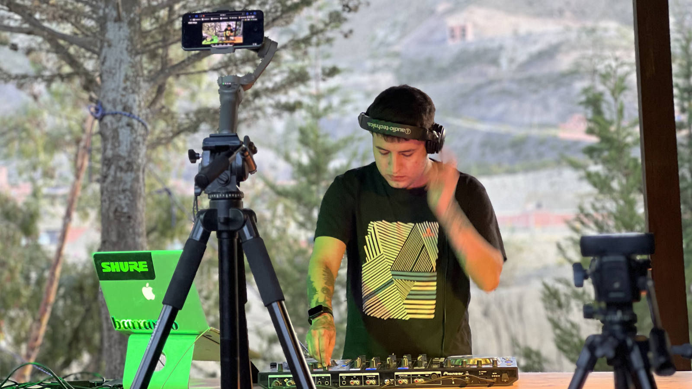

[4/20²⁶ 🌿](./README.md) > Participación Virtual

# Participación Virtual

**Encuentro Nacional 4/20²⁶ Pro-Legalización 🌿**  
*Celebración cultural replicable de ingreso y participación libre*

> 🌿 Lo virtual puede ser una de las formas más simples y expansivas de ayudar a que el encuentro brote más allá de una sola ciudad o un solo espacio físico.

> 🌿 También puede ser una puerta muy natural para artistas, DJs, celebraciones remotas, sets, transmisiones y colaboraciones híbridas entre sedes.

> ℹ️ No hay un formulario específico para participación virtual. En cambio, [artistas y música](https://forms.gle/jfiZqSWUhqTDG45C8), [espacios anfitriones](https://forms.gle/9KaoCBb7iaB3PV6x8) y [panelistas y conversación pública](https://forms.gle/Ufv8JDgU3FvjaAru9) pueden indicar allí mismo si su participación será virtual/remota.

> 🌿 Para gran parte del público, una de las mejores formas de ayudar en la estrategia pro-legalización es compartir todo lo referente al encuentro: links, posts, transmisiones, convocatorias y otras señales de que la conversación ya está viva.

## Qué lugar tiene lo virtual en el encuentro

Lo virtual no se piensa como un reemplazo de la experiencia presencial, sino como una capa que puede ampliarla, conectarla y volverla más abierta.

También puede ayudar a:

- Abrir el encuentro a otras ciudades y países.
- Dar lugar a artistas o propuestas que no pueden estar físicamente presentes.
- Conectar espacios entre sí.
- Hacer más visible la red que se está formando.
- Volver el encuentro más híbrido, poroso y replicable.

En muchos casos, una propuesta virtual puede ser una de las formas más accesibles de sumarse, tanto para una persona como para una sede.

Y no solo de sumarse: también puede ser una de las formas más accesibles de asistir, mirar y acompañar el encuentro desde otra ciudad, otro país o simplemente desde casa.

También puede ser una de las formas más simples en que el público general ayuda a mover la estrategia: compartiendo links, transmisiones, posts y convocatorias para volver más visible la red que se está formando.

## Qué tipo de participación virtual puede hacer sentido

La invitación está abierta, por ejemplo, a:

- Sets de DJ remotos
- Presentaciones musicales transmitidas
- Celebraciones virtuales desde otras ciudades
- Participación internacional
- Streaming de un segmento del encuentro
- Material audiovisual preparado para compartirse en vivo
- Colaboraciones entre espacios y artistas a distancia
- Difusión activa de links, posts, transmisiones y convocatorias del encuentro
- Otras formas virtuales que hagan sentido con el espíritu del [encuentro](./README.md)

Lo importante no es encajar en una categoría perfecta, sino ayudar a que el encuentro gane alcance, conexión y vida compartida.

## Cómo se entiende la participación virtual

La participación virtual, como la del público, la del espacio anfitrión y la de otras propuestas del encuentro, se piensa en principio como **voluntaria**.

Eso ayuda a mantener el espíritu general del proyecto y reduce fricciones innecesarias.

Si una participación requiere buena conexión, pruebas técnicas, horarios especiales, proyección, amplificación o alguna otra logística que excede lo razonable, la idea es que eso pueda hablarse con claridad. Cuando haga sentido, se conversará con claridad con la [comunidad](https://chat.whatsapp.com/KvN6wsDnoLR1ytdLJI3m00) y con el [espacio anfitrión](./SPACES.md) la mejor forma de coordinarlo.

## Qué puede hacer posible una capa virtual para un espacio que se suma

Una sede que se abre al encuentro no necesariamente tiene que limitarse a lo que ocurra solo dentro de sus paredes.

Dependiendo del momento, del espacio y de la red que se active, una capa virtual puede hacer posible:

- Invitar artistas que no están en la ciudad.
- Conectar una celebración con otra sede en paralelo.
- Compartir sets, saludos o intervenciones a distancia.
- Amplificar lo que ya está ocurriendo presencialmente.
- Darle al público la sensación de que forma parte de algo más amplio que su propia ciudad.
- Una experiencia que, bien llevada, se parezca a ser [voluntariado por un día](https://voluntariado.barranco.life/Actividades/A%C3%B1o_Nuevo.html): una pequeña prueba de lo que puede hacer posible una comunidad cuando se organiza con flexibilidad, hospitalidad y propósito compartido.

Eso no significa prometer resultados automáticos. Significa dejar abierta una posibilidad real y muy fértil.

## Lo general y lo particular de cada sede

No todos los espacios tienen que abrir una capa virtual del mismo modo.

Hay decisiones que pueden variar según cada sede, por ejemplo:

- Compartir solo una transmisión simple.
- Recibir un set remoto o una participación internacional.
- Proyectar o no una transmisión en público.
- Amplificar o no el sonido.
- Integrar lo virtual con [Artistas y Música](./ARTISTS.md), [Emprendimientos](./VENTURES.md), expo o vida de espacio.
- Usar redes propias, pantallas internas o una combinación de ambas.

La idea no es fijar un solo modelo, sino sumar posibilidades. Cada espacio puede adaptar estos lineamientos según su realidad, sabiendo que mientras más se aparte del espíritu general, más entra en decisiones propias y menos en una lógica ya probada por la experiencia compartida del [encuentro](./README.md).

## Caso particular: Proyecto Cultural Barranco

En [Proyecto Cultural Barranco](https://barranco.life), la idea es que la capa virtual pueda convivir orgánicamente con la celebración presencial.

Eso puede incluir:
- Pasar transmisiones en la televisión del espacio.
- Transmitir parte del encuentro desde las redes del Barranco: [Instagram](http://instagram.com/barranco.life), [Twitch](http://twitch.tv/barranco_life), [Facebook](https://facebook.com/barranco.life) y/o [TikTok](https://www.tiktok.com/@barranco.life).
- Y, si se organiza con tiempo, proyectar una transmisión y amplificar el sonido, por ejemplo en el espacio de *open deck* o en otro punto del encuentro que haga sentido.

La planificación concreta de esas transmisiones, enlaces y ventanas de participación se irá coordinando por el [grupo del encuentro](https://chat.whatsapp.com/KvN6wsDnoLR1ytdLJI3m00).

En el caso de otros eventos o celebraciones virtuales que se sumen al encuentro, la idea general es ayudar a difundirlos y compartir sus links desde la red del proyecto cuando haga sentido.

Eso no significa que Proyecto Cultural Barranco ofrezca de entrada apoyo técnico o logístico amplio para toda propuesta virtual. La ayuda puntual puede existir, pero la lógica general aquí es más bien abrir ventanas de transmisión, circulación y acompañamiento.

Esto abre varias posibilidades útiles:

- Que artistas o celebraciones remotas se sientan presentes dentro del encuentro.
- Que el público vea que el 4/20 no está ocurriendo solo en un lugar.
- Que otras ciudades o espacios puedan dialogar con el caso del Barranco en tiempo real.

No se presenta como modelo obligatorio. Se presenta como un caso vivo de referencia.

## Qué puede aportar el encuentro a una propuesta virtual

Así como un [espacio](./SPACES.md) puede abrirse a una nueva comunidad, también una propuesta virtual puede encontrar aquí:

- Un contexto cultural distinto al circuito habitual.
- Un público nuevo.
- Una posibilidad de colaboración sin necesidad de traslado físico.
- Un primer puente con espacios y redes que quizá luego quieran seguir conectándose.
- Una manera de participar en el encuentro incluso desde la distancia.

## Qué se valora en una participación virtual

Más allá del formato, se valora especialmente:

- Claridad para coordinar.
- Buena disposición para pruebas y tiempos.
- Comprensión del contexto cultural y legal.
- Apertura a formatos proporcionales al lugar y a la conexión disponible.
- Voluntad de aportar a una experiencia hospitalaria, no solo a una aparición aislada.
- Comprensión de que lo virtual también puede estar al servicio de quienes asisten a distancia, no solo de quienes participan activamente.
- Disposición a compartir y hacer circular lo referente al encuentro cuando eso ayude a volverlo más visible.

## Relación con otros documentos

Este archivo dialoga especialmente con:

- [Espacios Anfitriones](./SPACES.md)
- [Artistas y Música](./ARTISTS.md)
- [Colloquium](./COLLOQUIUM.md)
- [Participar](./PARTICIPATE.md)
- [Página principal del encuentro](./README.md)
- [Manual 4/20 🌿](https://manual420.barranco.life)
- [4/20²⁶ 🪴](https://chat.whatsapp.com/KvN6wsDnoLR1ytdLJI3m00)
- [Proyecto Cultural Barranco (Maps)](https://goo.gl/maps/iWB6R5HZnREL7ALKA)
- [Voluntariado Barranco](https://voluntariado.barranco.life/)
